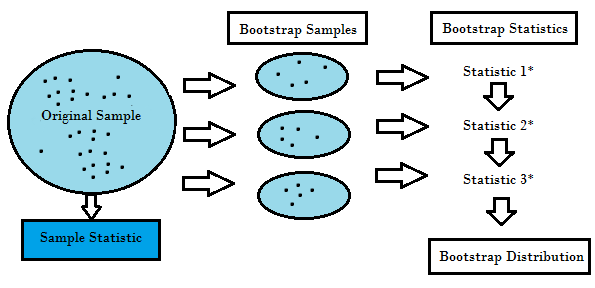
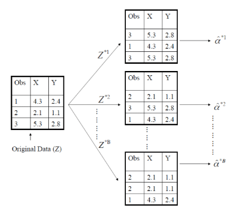
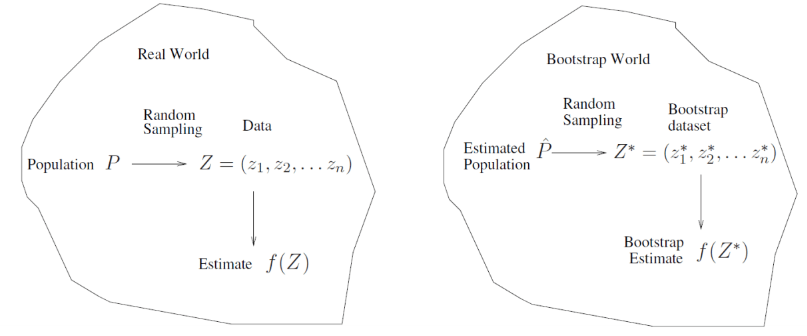
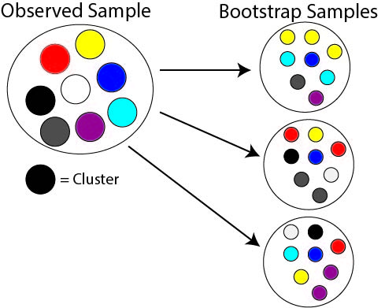

```{r setup, include=FALSE}
knitr::opts_chunk$set(echo = FALSE, message = FALSE, warning = FALSE,
                      fig.width = 6, fig.height = 3)
```

```{r packages, include=FALSE}
library(tidyverse)
library(mgcv)
library(splines)
library(ISLR)
library(caret)
library(rmarkdown)
```

# Review

- Homework 5 due on 3/5 at 11PM through GitHub Classroom
- Article Evaluation 2 assigned, due on 3/2 through GitHub Classroom
- Last lecture: cross validation

# Data partitioning

- **Recall**: can generate training and testing datasets using 
  - Holdout method
  - K-fold cross validation
  
<center>
  <figure>
    
  </figure>
</center>

# Bootstrap

- **Another method**: resampling via *bootstrap*
- **Idea**: generate multiple samples from data by *sampling with replacement* $m$ times
  - Repeat process $B$ times $\rightarrow$ $B$ samples of size $m$ each created
  - Calculate statistic in each $B$ samples $\rightarrow \{\hat{\alpha}_1, \ldots, \hat{\alpha}_B\}$
  - Use $\{\hat{\alpha}_1, \ldots, \hat{\alpha}_B\}$ to assess sample variability of $\hat{\alpha}$
  
<center>
  <figure>
    
  </figure>
</center>

# Bootstrap

- Simple example: computing sample mean
- Suppose sample of variable $X$ observed: $X_1,\ldots,X_n$ for $n=100$
- We know sample mean $\bar{X}\sim\text{Normal}(\mu, \sigma^2/n)$ by *Central Limit Theorem* 
- Suppose $\mu=0$ and $\sigma^2=1$.  Let's look at the distribution of $\bar{X}$ via bootstrap

```{r}
samples <- 1000
boots <- 1000
n <- 100
mu <- 0
sigma <- 1

mu_hat_per_sample <- rep(NA, samples)
mu_hat_boot <- rep(NA, boots)

for(i in 1:samples){
  set.seed(i)
  x <- rnorm(n, mu, sigma)
  mu_hat_per_sample[i] <- mean(x)
}

hist(mu_hat_per_sample,
     xlab = "Sample mean across samples", 
     main = "Approx. of sample mean distribution")

# Generate bootstrap distribution from single sample
set.seed(1)
x <- rnorm(n, mu, sigma)

for(i in 1:boots){
  # Generate indices for bootstrap sample
  set.seed(i)
  boot_index <- sample(1:n, n, replace = TRUE)
  x_boot <- x[boot_index]
  mu_hat_boot[i] <- mean(x_boot)
}

hist(mu_hat_boot,
     xlab = "Sample mean across bootstrap samples", 
     main = paste0("Bootstrap sample mean distribution\nMean=", 
                   round(mean(mu_hat_boot),2), ", SD=",
                   round(sd(mu_hat_boot), 2)))
```

# Bootstrap
- Can see variance of bootstrap sample means $\approx$ sample mean variance $1/\sqrt{100}$
  - Recall: also called **standard error** of statistic
- Can use to create confidence interval or do hypothesis testing as well
- Sampling with replacement $\rightarrow$ row can be included more then once
  - Idea: mimics *independent random sampling*
  - Ex. three observations, computing statistic $\hat{\alpha}$
  
<center>
  <figure>
    
  </figure>
</center>

# Bootstrap algorithm
Suppose $Z$ denotes the dataset with $n$ rows (obs) and $p$ columns (variables)

1. Randomly select $n$ obs from $Z$, creating **bootstrap dataset** $Z_1$
  - Selection done **with replacement**
2. Using $Z_1$ calculate statistic of interest, denoted $\hat{\alpha}_1$
3. Repeat 1 and 2 $B$ times, creating set of estimates: $\{\hat{\alpha}_1, \ldots, \hat{\alpha}_B\}$
4. Can estimate SE of statistic $\hat{\alpha}$ using bootstrap sample SE

$$
\hat{SE}_B(\hat{\alpha})=\sqrt{\frac{1}{B-1}\sum_{r=1}^{B}(\hat{\alpha}_r-\bar{\hat{\alpha}})^2}
$$

where $\bar{\hat{\alpha}}=\frac{1}{B}\sum_{r=1}^{B}\hat{\alpha}_r$ denotes bootstrap sample mean

- Can show $\hat{SE}_B(\hat{\alpha}) \approx SE(\hat{\alpha})$

# Bootstrap visual

<center>
  <figure>
    
  </figure>
</center>

# Bootstrap with clustered data
- Suppose some obs in sample are correlated
  - Denoted as *clusters*
- How does this change the bootstrap sampling?

<center>
  <figure>
    
  </figure>
</center>

# Bootstrap and prediction
- Using bootstrap for data partitioning
  - Use bootstrap as testing and original as training? (or vice versa)
  - **Issue**: Bootstrap as significant overlap with sample ($\approx\frac{2}{3}$)
  - $\rightarrow$ bootstrap error estimate **biased downward**
  - What about for tuning?  Sometimes used (`train` in `caret` uses by default)
- K-fold CV forces separate training and testing sets at each iteration
  - $\rightarrow$ **always use CV instead**
  - Possible solution with bootstrap: use **out-of-bag** (OOB) sample
  - OOB discussed with random forests later on
  