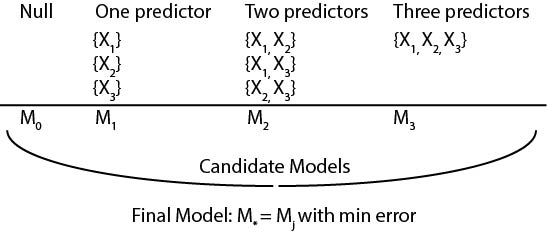
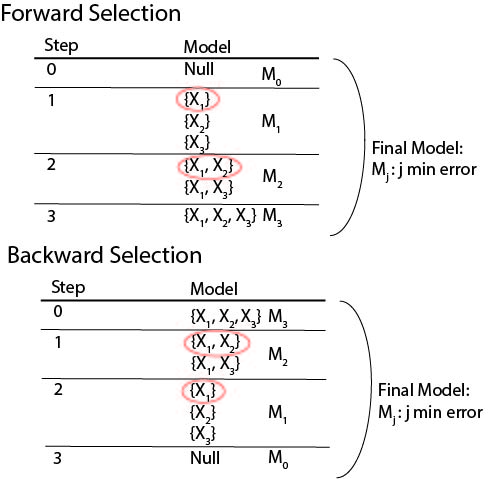
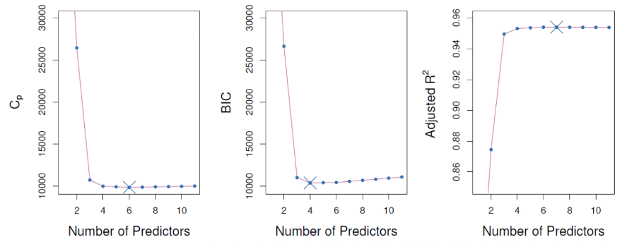

```{r setup, include=FALSE}
knitr::opts_chunk$set(echo = FALSE, message = FALSE, warning = FALSE,
                      fig.width = 6, fig.height = 3)
```

```{r packages, include=FALSE}
library(tidyverse)
library(mgcv)
library(splines)
library(ISLR)
library(caret)
library(rmarkdown)
```

# Model Building
- When building a statistical model, may have to choose one setup vs others
  - Ex. tuning parameters, **which features to use**, etc.
  - More complex model $\nrightarrow$ ``best''
  - Need metrics to help us select *final model*
  - Discussed using prediction error, but may want to consider other factors
    - Ex. model complexity/interpretability
- Here, we focus on **regression models**
    
# Model selection in regression
- **Setup**: response $Y$, features $X_1,\ldots,X_p$
- **Model**: 

$$
Y=\beta_0+\beta_1X_1+\ldots+X\beta_pX_p+\epsilon
$$

- May want to ID **subset of predictors** which are *most relevant* to prediction
  - Makes model simpler, may $\downarrow$ overfitting/variance and $\uparrow$ interpretability
  - Denote this subset by $S\subset\{1,\ldots,p\}$ with model
  
$$
Y=\beta_0+\sum_{j\in S}\beta_jX_j+\epsilon
$$

- May want data-driven way of selecting subset

# Model selection methods

1. Subset selection
    - ID subset of predictors through some iterative procedure based on chosen metric
2. Shrinkage
    - Fit model with all $p$ predictors, but include *penalty* term to least squares process
    - Penalty *shrinks* small magnitude estimates to 0
    - Also called *regularization*
    
# Model selection methods

3. Dimension reduction
    - Project set of $p$ predictors into $M$ dimensional space, $M<p$
    - Use predictors in new space in regression model
    - Space often = $M$ linear combinations of $p$ predictors
    
<center>
  <figure>
    
  </figure>
</center>
  
# Subset selection
- Let $M_0$ denote the *null model* where $\hat{Y}=\bar{Y}$ (sample mean)
- Then, create candidate models $M_1, \ldots, M_p$:
  - For $j=1,\ldots,p$, select $M_j$=*best* subset of predictors of size $j$
  - *Best* based on chosen metric such as MSE, $R^2$, RSS, etc.
- Select *best* model outcome of candidate models $M_0, M_1, \ldots, M_p$
  - Again, based on chosen metric (which also penalizes overfitting)
  - Ex. cross-validated prediction error or corrected training set metric
  
# Subset selection
- Ex. $Y$ and predictor set $X_1, X_2, X_3$

<center>
  <figure>
    
  </figure>
</center>

- Limitations
  - Cannot be computed with **very large $p$** ($p>n$)
  - Huge search space $\rightarrow$ high chance of selecting model which overfits
  - Also $\rightarrow$ hard to confidently tell if model is ``best'' beyond random chance
  - Not compuationally efficient as $p$ increases
  
# Forward stepwise selection
- Algorithm:
  1. Start with null model $M_0$, no predictors
  2. For $k=0, \ldots, p$:
      - Consider $p-k$ models which add one predictor to $M_k$
      - Choose *best* among these models
      - Set this as model $k+1$, move to $k+1$ as starting point
      - Results in candidate models $M_0, \ldots, M_p$
  3. Select *best* from set of candidate models

# Forward stepwise selection
- Computationally less intensive then best subset
  - Much less models fit and examined
- Not guaranteed to find best possible model (some combos not tried)
- Cannot be run when $p>n$

# Backward stepwise selection
- Algorithm:
  1. Start with full $M_p$, all predictors
  2. For $k=p, p-1, \ldots, 0$:
      - Consider $k$ models which contains all but one of the predictors in $M_k$
      - Choose *best* among these models
      - Set this as model $k+1$, move to $k+1$ as starting point
      - Results in candidate models $M_0, \ldots, M_p$
  3. Select *best* from set of candidate models
  
# Backward stepwise selection
- Computationally less intensive then best subset
  - Much less models fit and examined
- Not guaranteed to find best possible model (some combos not tried)
- Cannot be run when $p>n$

# Stepwise selection visuals
<center>
  <figure>
    
  </figure>
</center>

# Choosing a metric
- Recall in all stepwise methods, candidate models selected using RSS, $R^2$, etc.
- When candidate models compared, **need to use test set error**
  - Or some approximation
  - Training error would **not** result in optimal model
- Either 1) *adjust* training error or 2) *directly* estimate testing error

# Adjusted metrics
- Calculated from training set **but** penalize model complexity
- Examples: $C_p$, AIC, BIC, adjusted $R^2$
<center>
  <figure>
    
  </figure>
</center>

# Details on metrics

Mallow's $C_p$:

$$
C_p=\frac{1}{n}(\text{RSS}+2d\hat{\sigma}^2)
$$
  
  - $d$=\# of non-zero parameters
  - $\hat{\sigma}^2$= estimate of $\epsilon$ variance
  
AIC:

$$
AIC=-2\log(L)+2*d
$$

  - $d$=\# of non-zero parameters
  - $L$ is maximized likelihood based on model
  - With linear model with $\epsilon\sim\text{Normal}(0,\sigma^2)$, AIC=$C_p$
  
# Details on metrics

BIC:

$$
BIC=\frac{1}{n}(RSS+\log(n)d*\hat{\sigma}^2)
$$

  - Uses different penalty then $C_p$
  - Since $\log(n)>2$ for $n>7$, BIC penalty generally higher
  - $\rightarrow$ smaller model then $C_p$ often chosen
  
Adjusted $R^2$:

$$
\text{Adjusted }R^2=1-\frac{RSS/(n-d-1)}{TSS/(n-1)}
$$

where $TSS$ is total sum of squares
  - Like $R^2$, but with penalty added for more complex model
  
# Using cross-validation

- **Recall**: selection methods return candidate models $M_k$ for $k=0, 1, \ldots$
- **Goal**: select *best* model $\leftrightarrow$ select $\hat{k}$, $M_{\hat{k}}$
- To do this, need to compute each model's test set error using CV
- **Better then using adjusted metrics**
  - Direct estimate of test set
  - Doesn't require estimate of error variance $\sigma^2$
  - More flexible, as doesn't require likelihood, $\sigma^2$ estimator
- **But** may be computationally costly

# Model selection in R

- Let's predict cancer mortalities at the county level
  - Use AIC with backward selection

```{r echo=TRUE, results='hide'}
cancer_data <- read_csv("../data/cancer_reg.csv") %>%
  select(-avgAnnCount, -avgDeathsPerYear, -incidenceRate, -binnedInc, -Geography) %>%
  select(TARGET_deathRate, medIncome, povertyPercent, MedianAge:BirthRate) %>%
  drop_na()

lm_stepwise <- train(TARGET_deathRate~., data=cancer_data,
                     method="leapBackward",
                     tuneGrid = data.frame(nvmax = 1:(dim(cancer_data)[2]-1)),
                     trControl = trainControl(method = "cv"))
```

```{r }
lm_stepwise
lm_stepwise$resample
colMeans(lm_stepwise$resample[,1:3])
coef(lm_stepwise$finalModel, 15)
```

# Model selection in R

- Alternative method

```{r echo=TRUE, results='hide'}
lm_stepwise <- train(TARGET_deathRate~., data=cancer_data,
                     method="lmStepAIC",
                     trControl = trainControl(method = "cv"))
```

```{r }
lm_stepwise
lm_stepwise$resample
colMeans(lm_stepwise$resample[,1:3])

lm_stepwise$finalModel$anova
summary(lm_stepwise)
```