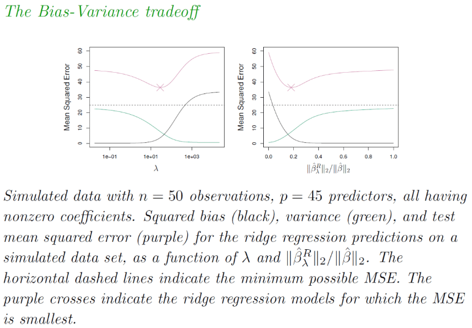
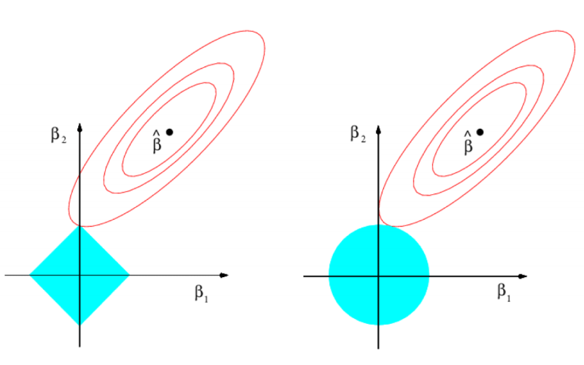
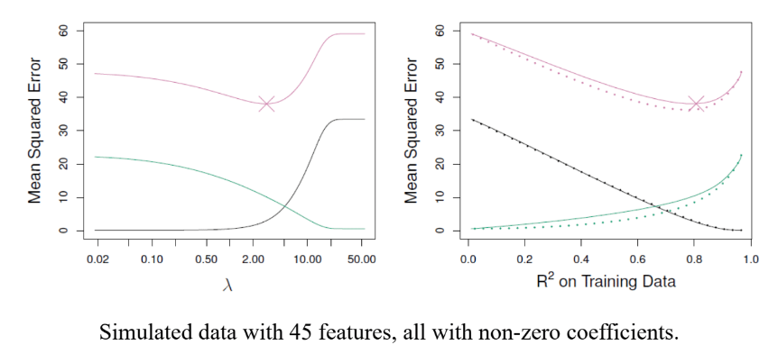
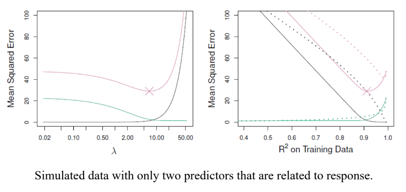
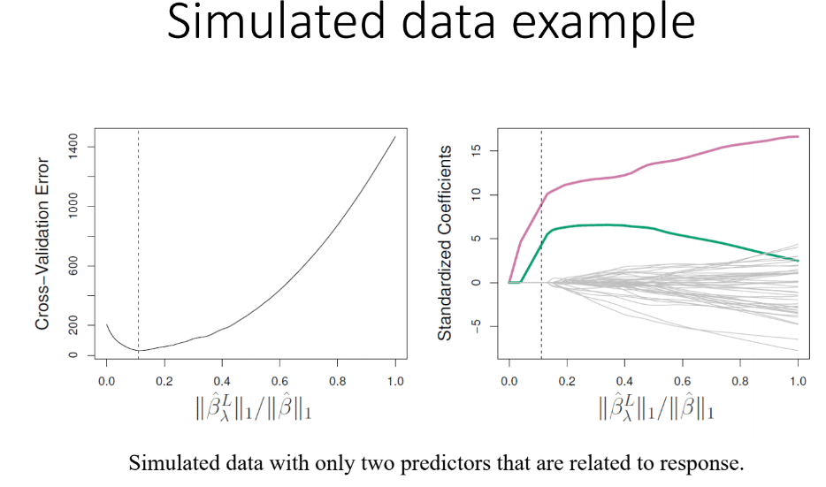
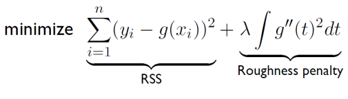

```{r setup, include=FALSE}
knitr::opts_chunk$set(echo = FALSE, message = FALSE, warning = FALSE,
                      fig.width = 6, fig.height = 3)
```

```{r packages, include=FALSE}
library(tidyverse)
library(mgcv)
library(glmnet)
library(ISLR)
library(caret)
library(rmarkdown)
```

# Review

- Homework 5 due on 3/5 at 11PM through GitHub Classroom
- Last lecture: model selection

# Model selection
- **Goal**: Choose/build model parameters and structure to create *optimal* model
- General methods:

1. Subset Selection
2. **Shrinkage**
3. Dimension Reduction

# Shrinkage
- **With regression**: estimate regression parameters by *minimizing squared residual error*
- **With subset selection**: fit multiple models by least squares, select *best*
- **With shrinkage**: fit model with all $p$ predictors *once* with method that *shrinks* low magnitude coefficients to 0

# Penalized regression
- With traditional regression:

$$
\begin{align}
&Y = \beta_0+\beta_1X_1+\ldots+\beta_pX_p+\epsilon \\
&\hat{\beta} = \min_{\beta} \sum_{i=1}^{n} [Y_i-(\beta_0+\beta_1X_1+\ldots+\beta_pX_p)]^2
\end{align}
$$

- With penalized regression:

$$
\begin{align}
&Y = \beta_0+\beta_1X_1+\ldots+\beta_pX_p+\epsilon \\
&\hat{\beta} = \min_{\beta} \sum_{i=1}^{n} [Y_i-(\beta_0+\beta_1X_1+\ldots+\beta_pX_p)]^2+\lambda\sum_{j=1}^{p}||\beta_j||^q \\
&\text{where } \lambda >0
\end{align}
$$

- Penalized regression $\rightarrow$ need to minimize $RSS$ **and** penalty from $\beta>0$
  - Will force low magnitude $\beta \rightarrow 0$
  - Need to choose how to compute magnitude of $\beta$, denoted *norm*=$||.||_q$
  
# Ridge regression
- **Recall**: Residual sum of squares ($RSS$)

$$
RSS(\beta)=\sum_{i=1}^{n} [Y_i-(\beta_0+\beta_1X_1+\ldots+\beta_pX_p)]^2
$$

- Use **square norm**:

$$
\hat{\beta} = \min_{\beta} RSS(\beta)+\lambda\sum_{j=1}^{p}(\beta_j)^2
$$

- $\lambda>0$ is a *tuning parameter*, must be chosen and fixed
  - Can use cross validation (CV), holdout, metrics like AIC, BIC, etc.
  - Generally **CV is best**
  
# Ridge regression example
- Ex. cancer mortality at county level

```{r echo=TRUE, fig.width = 5, fig.height = 5}
cancer_data <- read_csv("../data/cancer_reg.csv") %>%
  select(-avgAnnCount, -avgDeathsPerYear, -incidenceRate, -binnedInc, -Geography) %>%
  select(TARGET_deathRate, medIncome, povertyPercent, MedianAge:BirthRate) %>%
  drop_na()

lm_ridge <- cv.glmnet(x=as.matrix(cancer_data[,-1]), y=unlist(cancer_data[,1]), alpha = 0)
plot(lm_ridge)

lm_ridge <- glmnet(x=as.matrix(cancer_data[,-1]), y=unlist(cancer_data[,1]), 
                      alpha = 0)
plot(lm_ridge, xvar = "lambda")
```

# Ridge regression and scaling
- **Recall**: Standard least squares estimates are *scale equivalent*
  - Multiplying predictor $X_j$ by constant $c$ simply re-scales $\hat{\beta}_j$ by $1/c$
  - $\rightarrow X_j\hat{\beta}_j$ always the same
- **Not the case** with penalized regression
  - Scale of $\beta_j$ determines if it is shrunk towards 0
  - Use of **squared norm** makes scaling even more impactful
- Thus, best to apply after **standardizing the predictors**:

$$
\tilde{x_{ij}}=\frac{x_{ij}}{\sqrt{\frac{1}{n}\sum_{i=1}^{n}(x_{ij}-\bar{x_j})^2}}
$$

# Scaling example in data
```{r echo=TRUE, fig.width = 5, fig.height = 5}
lm_ridge <- 
  cv.glmnet(x=scale(as.matrix(cancer_data[,-1])), 
            y=unlist(cancer_data[,1]),
            alpha = 0)
plot(lm_ridge)

lm_ridge <- glmnet(x=scale(as.matrix(cancer_data[,-1])), y=unlist(cancer_data[,1]), 
                      alpha = 0)
plot(lm_ridge, xvar = "lambda")
```

# How does ridge regression improve over least squares?

<center>
  <figure>
    
  </figure>
</center>

# LASSO
- Ridge regression **disadvantage**:
  - Will **shrink unimportant coefficients to 0** but will **not** remove predictors near 0
  - Thus does not perform *model selection*, all $p$ predictors still kept in model
- **Solution**: *Lasso*
  - Method:
  
$$
\hat{\beta} = \min_{\beta} RSS(\beta)+\lambda\sum_{j=1}^{p}|\beta_j|
$$

  - Uses $L_1$ norm, defined as $||\beta||_1=\sum_{j}|\beta_j|$
  
# LASSO vs ridge
- LASSO also shrinks coefficient estimates to 0
- **However**, will set low magnitude coefficients **to exactly 0**, thus removing them
  - $\rightarrow$ can be used for model selection
  - Amount set to 0 depends on $\lambda$ choice
  - $\rightarrow$ lasso yields *sparse* models
  
<center>
  <figure>
    
  </figure>
</center>

# LASSO example
- Ex. cancer mortality at county level

```{r echo=TRUE, fig.width = 5, fig.height = 5}
cancer_data <- read_csv("../data/cancer_reg.csv") %>%
  select(-avgAnnCount, -avgDeathsPerYear, -incidenceRate, -binnedInc, -Geography) %>%
  select(TARGET_deathRate, medIncome, povertyPercent, MedianAge:BirthRate) %>%
  drop_na()

lm_ridge <- cv.glmnet(x=as.matrix(cancer_data[,-1]), y=unlist(cancer_data[,1]), alpha = 1)
plot(lm_ridge)

lm_ridge <- glmnet(x=as.matrix(cancer_data[,-1]), y=unlist(cancer_data[,1]), 
                      alpha = 1)
plot(lm_ridge, xvar = "lambda")
```


# LASSO vs Ridge: Simulations
<center>
  <figure>
    
  </figure>
</center>

# LASSO vs Ridge: Simulations
<center>
  <figure>
    
  </figure>
</center>

# Tuning parameter selection
- Need to specify $\lambda>0$ when using penalized regression
- Don't know which predictors are important before analysis, need some metric to guide selection
- **Cross validation** common way of doing this process
  - First, setup grid of $\lambda$ values to try
  - For each value, compute CV error
  - Choosen lambda which minimizes CV error
  - Refit penalized regression with chosen $\lambda$
  
# Tuning parameter selection: simulated data
<center>
  <figure>
    
  </figure>
</center>

# Other penalized regression methods

- Smoothing splines

<center>
  <figure>
    
  </figure>
</center>

- Group Lasso

- Fused Lasso
  - For data with temporal or spatial structure
  
- Elastic Net

$$
\hat{\beta} = \min_{\beta} RSS(\beta)+\lambda_1\sum_{j=1}^{p}|\beta_j|+\lambda_2\sum_{j=1}^{p}(\beta_j)^2
$$

# Song of the session
[Africa Brasil by Jorge Ben Jor](https://en.wikipedia.org/wiki/%C3%81frica_Brasil)

[O Plebeu by Jorge Ben Jor](https://open.spotify.com/album/0esHQqYklDPje00NUNq6py)

[Taj Mahal by Jorge Ben Jor](https://open.spotify.com/album/0esHQqYklDPje00NUNq6py)

<center>
  <figure>
    
  </figure>
</center>