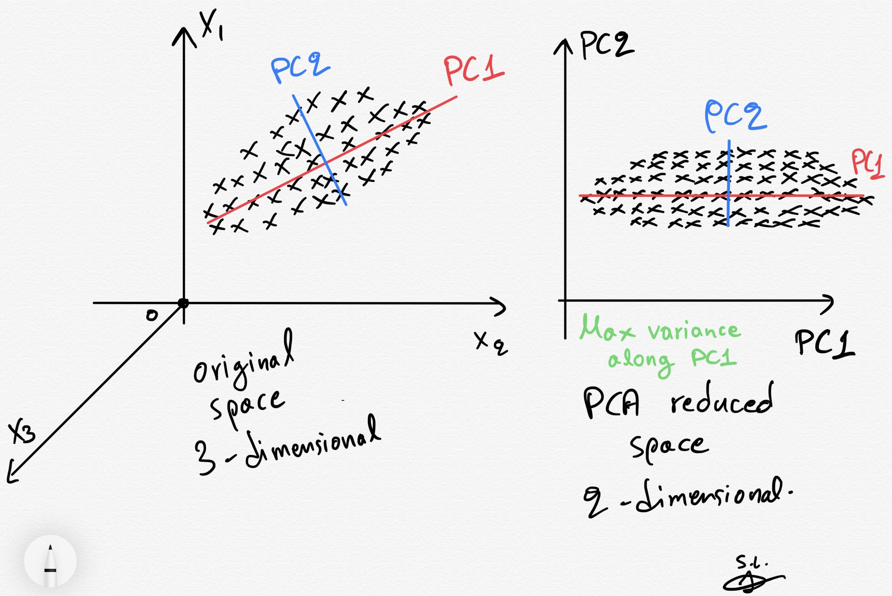
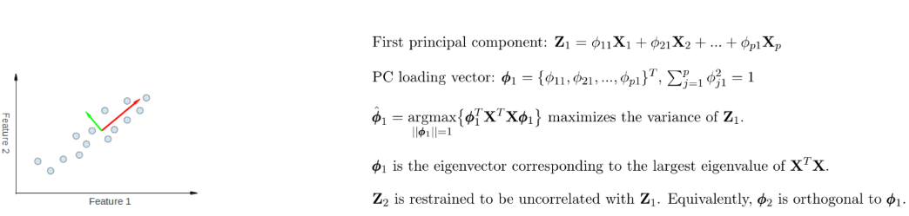
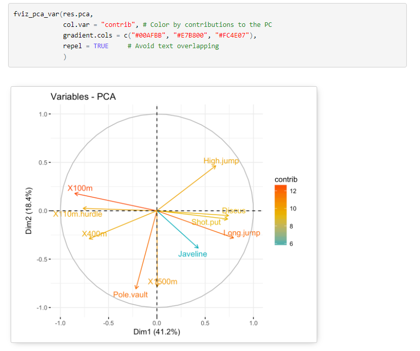
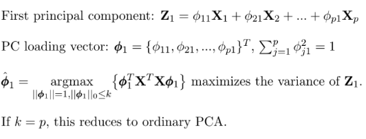

```{r setup, include=FALSE}
knitr::opts_chunk$set(echo = TRUE, message = FALSE, warning = FALSE,
                      fig.width = 6, fig.height = 3)
```

```{r packages, include=FALSE, echo=FALSE}
library(tidyverse)
library(mgcv)
library(glmnet)
library(ISLR)
library(caret)
library(rmarkdown)
library(GGally)
library(factoextra)
library(elasticnet)
```

# Review

- Midterm assigned on Github Classroom, due on 3/19 by 11PM EST
- Article evaluation 3 assigned on Github Classroom, due on 3/23 by 11PM EST
- Last lecture: shrinkage and penalized regression

# Model selection
- **Goal**: Choose/build model parameters and structure to create *optimal* model
- General methods:

1. Subset Selection
2. Shrinkage
3. **Dimension Reduction**

# Dimension Reduction

- For data with large $p$, may want to **reduce predictor set**
  - Reduces chance of overfitting, estimation variance
  - Predictors may be highly correlated, but still important to assess
  - Traditional regression with $p>n$ not computationally possible
- Idea: **project predictor space into reduced dimensional space**
  - Use these new variables as regression model predictors
  
<center>
  <figure>
    
  </figure>
</center>

# Principal Components Regression
- Original predictors: $X_1, \ldots, X_p$
- New set: $Z_1, \ldots, Z_M$ where $M<p$
  - Suppose $Z_i$ are **linear combinations** of $X_1, \ldots, X_p$
  
$$
Z_m = \sum_{j=1}^{p}\phi_{jm}X_j
$$
- Regression model:

$$
Y_i = \theta_0+\sum_{m=1}^{M}\theta_mZ_{im}+\epsilon_i
$$

- Dimension of model reduced from $p+1$ to $M+1$
- **How do we decide on reduced set?**
  1. How big should $M$ be?
  2. How to estimate $\{\phi_{jm}\}$?

# Principal Components Analysis (PCA)
- PCA creates reduced set of predictors **equal to linear combos** of original set
- Method:
  - First *principal component* (PC):
  
$$
\begin{align}
&Z_1=\phi_{11}X_1+\phi_{21}X_2+\ldots+\phi_{p1}X_p \\
\hat{\phi_1}&=\underset{||\phi_1||=1}{\text{argmax}}[\text{Var}(\phi_{11}X_1+\phi_{21}X_2+\ldots+\phi_{p1}X_p)] \\
&=\underset{||\phi_1||=1}{\text{argmax}}(\phi_{11}^2+\phi_{21}^2+\ldots+\phi_{p1}^2+2\phi_{11}\phi_{21}\rho_{12}+\ldots+2\phi_{11}\phi_{p1}\rho_{1p}+\ldots+2\phi_{p-1,1}\phi_{p1}\rho_{p-1,p})
\end{align}
$$

  - $\rho_{ij}=\text{Cor}(X_i, X_j)$
  - First PC = linear combo containing **maximum amount of variability between predictors**
  - Weights $\phi_{ij}$ call *loadings*
  
# PCA details
- $||\phi_1||=1 \rightarrow\sum_{j=1}^{p}\phi_{j1}^2=1$
- Above assumes $X$ predictor matrix is *centered* ($X_j$ have mean 0) and scaled (have variance 1)
- Can then compute PC values for each observation:

$$
Z_{i1}=\phi_{11}X_{i1}+\phi_{21}X_{i2}+\ldots+\phi_{ip}X_{ip} \text{ for }1\leq i \leq n
$$

- For next PC $Z_2$, same process is done but $\text{Cor}(Z_1, Z_2)=0$ assumed
  - $\rightarrow \phi_2$ and $\phi_1$ are *orthogonal*
  
# PCA recap
- PCA uses an **orthogonal transformation** to convert predictor set into new set of **uncorrelated** predictors equal to **linear combinations** of the original set
- Can compute new variables for each observation using **loadings**

<center>
  <figure>
    
  </figure>
</center>

# PCA example
- Suppose we have a large amount of regional brain activity measures on group of infants
- Want to see if this regional brain activity is related to diganosis of Autism (ASD)

```{r fig.width = 6, fig.height = 4}
brain_data <- read_csv("../data/IBIS_brain_data_ex.csv") 

brain_data <- brain_data %>%
  select("CandID", "RiskGroup", names(brain_data)[grepl("V12", names(brain_data))]) %>%
  select(CandID:Uncinate_R_V12) %>%
  drop_na()

dim(brain_data)

# Run PCA on brain variables
pca_brain <- prcomp(brain_data %>% 
                      select(LeftAmygdala_V12, RightAmygdala_V12,
                             PreCG_L_V12:Uncinate_R_V12) %>% as.data.frame(),
                    cor=TRUE, scores=TRUE)

# Scree plot
fviz_eig(pca_brain)

# Plot PC scores
# First will center and scale PC2
data_for_plot <- scale(pca_brain$x)
  
# Add in diagnosis back
data_for_plot <- data.frame(data_for_plot, 
                     "RiskGroup"=brain_data$RiskGroup,
                     "CandID"=brain_data$CandID)

ggplot(data = data.frame(data_for_plot),
       mapping = aes(x=PC1, y=PC2, color=RiskGroup))+
  geom_point()+
  geom_hline(yintercept=0, linetype="dashed")+
  geom_vline(xintercept=0, linetype="dashed")+
  theme_bw()
```

# PCA example
- Explain overall track and field athlete performance using results in many events

<center>
  <figure>
    
  </figure>
</center>

# Sparse PCA

- Some predictors may not be very useful in principal components
  - However, loadings **won't be exactly 0**
  - **Idea**: apply penalized regression idea to PCA
  - Called *sparse PCA*
  
<center>
  <figure>
    
  </figure>
</center>

# Sparse PCA in R
```{r fig.width = 6, fig.height = 4}
# Run sparse PCA on brain variables
spca_data <- brain_data %>% 
                      select(LeftAmygdala_V12, RightAmygdala_V12,
                             PreCG_L_V12:Uncinate_R_V12) %>% as.data.frame()

sparsepca_brain <- spca(x=spca_data,
                    K=4,
                    para = rep(1, dim(spca_data)[2]),
                    sparse="penalty",
                    use.corr=TRUE)

# Look at loadings
apply(X=sparsepca_brain$loadings, MARGIN=2, function(x){sum(x==0)})
```
# Principal Components Regression
- Regression Model: $Y$=outcome, $Z_1, \ldots, Z_M$=predictors
  - $Y$ not used in creation of predictors, thus *unsupervised*
  - $\rightarrow$ PCs may best explain predictors but may **not** be best set at also **predicting response**
  
- Solution: *partial least squares* (PLS)

# Partial Least Squares
- **Goal**: Find set of $Z_1, \ldots, Z_M$ that best summarizes $X_1, \ldots, X_p$ **and** their relationship to outcome $Y$
- Method:
  1. Standardize $p$ predictors
  2. For first component $Z_1:$
      - Set each $\phi_{1j}$ from PCA equal to $\beta$ from regression of $Y$ onto $X_j$
      - Results in $Z_1=\sum_{j=1}^{p}\phi_{1j}X_j$
      - Then compute residuals of regressing $Y$ onto $Z_1$
  3. Repeat for desired number of components
- Fit in R: `pls` package