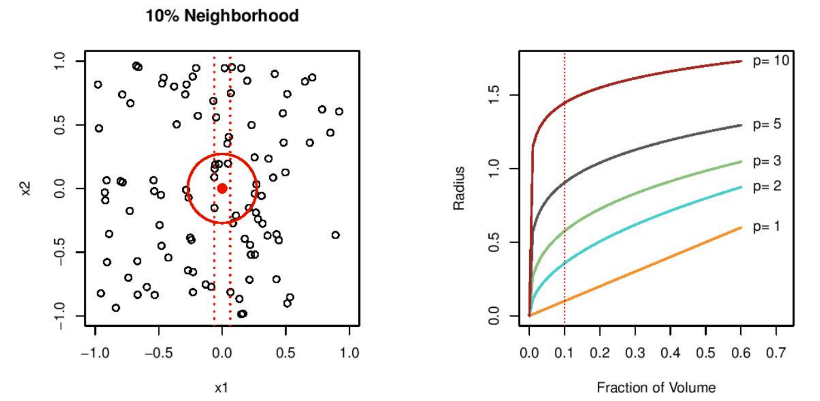
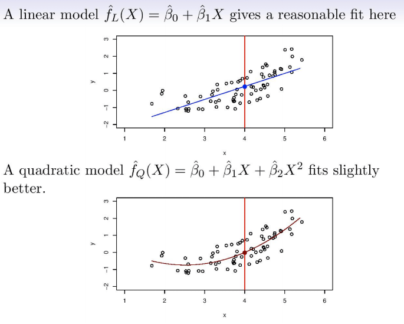
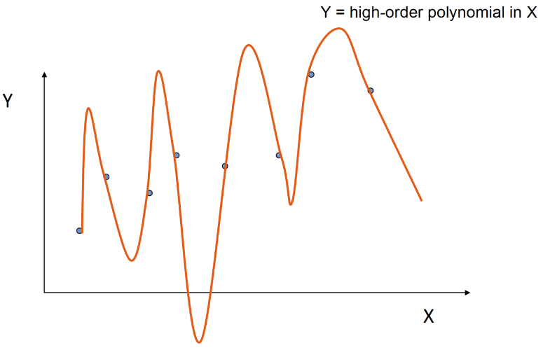
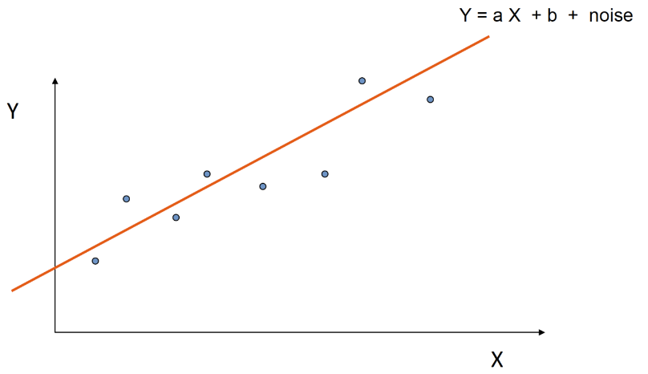
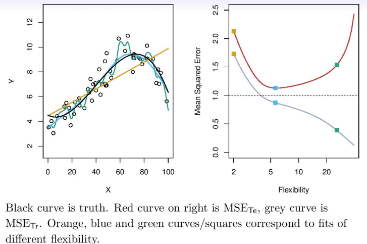
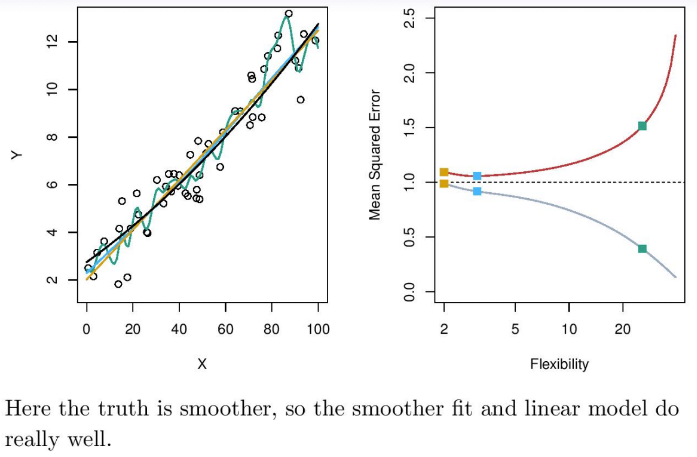
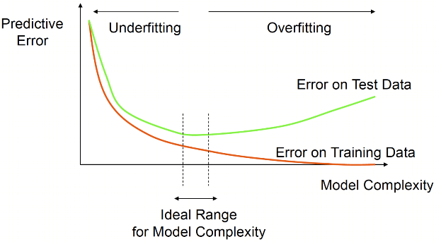

```{r setup, include=FALSE}
knitr::opts_chunk$set(echo = FALSE, message = FALSE, warning = FALSE,
                      fig.width = 11, fig.height = 4)
```

```{r packages, include=FALSE}
library(tidyverse)
library(ggpubr)
library(scales)
library(broom)
library(flextable)
library(scatterplot3d)
library(rgl)
```

# Review

- First lecture on 1/19
- GitHub accounts created, usernames shared with me
- Course syllabus, schedule, and first recorded lecture posted to Sakai
- Homework 1 assigned, due on 1/27 through GitHub Classroom

# Prediction Model
**Recall**: Pattern recognition algorithm "trained" using observed dataset

<center>
<figure>
    
</figure>
<figure>

Let's formalize this idea using math notation

# Prediction Model
**Example**: Consider data on basketball teams (NBA)
```{r nba_model_ex}
nba_teams_data <- read_csv("../data/nba_teams_19_20.csv") %>%
  mutate(playoffs=ifelse(grepl("\\*",Team), "Yes", "No"),
         Team=gsub("[*]","",Team)) %>%
  filter(Team!="League Average")

y_var <- "W"
x_vars <- c("ORtg", "DRtg", "SOS")
y_var_label <- "Wins"
x_vars_labels <- c("Offensive Rating (ORTG)", "Defensive Rating (DRTG)", "Strength of Opponents (SOS)")

plots_list <- list()
for(i in 1:length(x_vars)){
  plots_list[[i]] <- 
    ggplot(data=nba_teams_data, 
           mapping=aes_string(y=y_var, x=x_vars[i]))+
    geom_point(size=2)+
    geom_smooth(method="lm", size=2, se=FALSE)+
    scale_x_continuous(breaks = breaks_extended(n = 5))+
    labs(x=x_vars_labels[i], y=y_var_label)+
    theme_bw()+
    theme(text = element_text(size=15))
}
ggarrange(plotlist=plots_list, nrow = 1)
```

**Consider**: Predict teams wins using three variables

First, visualize data with line of best fit

# Prediction Model
Let's predict wins using all three variables simultaneously

**Model**: $wins \approx f(ORTG, DRTG, SOS)$

**Notation**: $wins$ is the variable we want to predict $\equiv$ *response*

$ORTG, DRTG, SOS$ are variables used to predict response $\equiv$ *feature* or *predictor*

*Response* denoted mathematically by variable $Y$

*Features* denoted by variables $X_1, X_2, \ldots, X_p$

# Prediction Model
**Combining everything together**

Can denote set of features as vector:

$$
X=
\left(\begin{array}{c} 
X_1 \\
X_2 \\
... \\
X_p
\end{array}\right)=
\left(\begin{array}{c} 
ORTG\\ 
DRTG\\
SOS
\end{array}\right)
$$ 

With model denoted by

$$
Y=f(X)+\epsilon
$$ 

where $\epsilon$ denotes model *error*

# Prediction Model
How to use model $f$:

- For $X=x$, can predict $Y$
- Which variables are "important" in predicting $Y\equiv wins$?
- Which are not important in the prediction?
- How is each variable in $X$ associated with $Y$?

# Prediction Model
Often, we define model as $$f(X)=E(Y|X=x)$$
```{r mean_ex, fig.width = 8, fig.height = 3}
ggplot(diamonds, 
       mapping = aes(x=carat, y=price))+
  geom_point(size=2, color="gray")+
  geom_smooth(size=2, se=FALSE)+
  geom_vline(xintercept = 2, size=2)+
  labs(x="X", y="Y")+
  theme_bw()+
  theme(text=element_text(size=15))
```

Predict outcome based on *expected value* (mean) at specific feature value(s)

$$f(2)=E(Y|X=2)$$

# Model Evaluation
How to evaluate model $f$?

Supposed we are in **supervised learning** context:

One measure of accuracy: *mean squared error* $(MSE)$

$MSE(x) = E[(Y-f(X))^2|X=x]$ across all possible $x$

*Ideal* or *optimal* $f$ which minimizes $MSE(x)$ across all $x$

# Model Evaluation
For given model $f$, *residual* at $X=x$ for $Y$ is $$\epsilon = Y - f(x)$$

Cannot zero out residual for all cases due to variability around mean at $X=x$

Thus, referred to as *irreducible* error

**Goal**: if $f=E(Y|X=x)$ want to estimate it with model **as close as possible**

Estimate denoted by $\hat{f}(x)$

$MSE$ for estimate at $X=x$ can be decomposed into $$MSE_{\hat{f}}(x)=E[(Y-\hat{f}(X))^2|X=x]=[f(x)-\hat{f}(x)]^2+Var(\epsilon)$$

# Model Evaluation
**Goal**: find best estimate of $f(x)$ using, estimate $\hat{f}(x)$, define as prediction model

Can see best estimate **minimizes difference with true mean**

How to estimate?

- Line of best fit
- Non-linear best fit

# Model Estimation

**Nearest Neighbor**: For given $X=x$ estimate expected $Y$ based on observed values of $Y$ near $x$ in data

Cannot estimate based on values of $Y$ **at** $x$ since amount of data there likely small

Mathematically: $\hat{f}(x)=\text{Ave}[Y|X \in \delta(x)]$

where $\text{Ave}$ denotes a weighted average

$\delta(x)$ is some neighborhood around $x$

Ex. Predicting wins using net rating ($ORTG-DRTG$)
```{r nba_neighbor_ex}
ggplot(data=nba_teams_data, 
           mapping=aes(y=W, x=NRtg))+
    geom_point(size=2)+
    geom_smooth(size=2, se=FALSE)+
    scale_x_continuous(breaks = breaks_extended(n = 5))+
    labs(x="Net Rating: ORTG-DRTG", y="Wins")+
    geom_vline(xintercept = 2.5, size = 2)+
    geom_vline(xintercept = 1, size = 2, linetype="dashed", color="red")+
    geom_vline(xintercept = 4, size = 2, linetype="dashed", color="red")+
    theme_bw()+
    theme(text = element_text(size=15))
```

# Curse of Dimensionality
**Idea**: Higher dimensional models (more features) may have **worse** performance then smaller models

**Why?**: Higher dimension $\implies$ higher prediction variability

May result in *overfitting* to training data

**Ex.** with nearest neighbor

Need large enough $\delta(x)$ to have a good, stable estimate

Too large $\implies$ estimate is inaccurate, **lose benefit** of local averaging

Many features/high dimension $\implies$ neighbors tend to be far away

# Curse of Dimensionality
<center>
<figure>
    
</figure>
<figure>

# Parametric Modeling
Simpler estimate of $f$: linear regression model

$f_{L}(X) \approx \beta_0+\beta_1X_1+\ldots+\beta_pX_p$

where we estimate $f_L$ best estimating $\beta_0, \ldots, \beta_1$ using *line of best fit*

$\hat{f}(X) = \hat{\beta}_0+\hat{\beta}_1X_1+\ldots+\hat{\beta}_pX_p$

Ex. predicting wins in NBA data using $ORTG, DRTG, SOS$
```{r nba_lm_ex}
# Center to make intercept interpretable
nba_teams_data_center <-
  nba_teams_data %>%
  mutate(ORtg = ORtg - mean(ORtg),
         DRtg = DRtg - mean(DRtg),
         SOS = SOS - mean(SOS))
  
# Fit linear model
lm_fit <- lm(W~ORtg+DRtg+SOS, data=nba_teams_data_center)

# Calc MSE
lm_abse <- mean(abs(lm_fit$residuals))
lm_mse <- mean((lm_fit$residuals)^2)

# Create table for results
tidy(lm_fit) %>%
  select(term, estimate) %>%
  flextable() %>%
  set_header_labels(term = "Feature Parameter", estimate = "Estimate") %>%
  add_header_lines(values =
                     c(paste0("Mean Absolute Error = ", round(lm_abse,2)), 
                       paste0("Mean Squared Error = ", round(lm_mse,2)))) %>%
  set_table_properties(width = 0.3, layout = "autofit")
```

# Parametric vs Nonparametric
- **Parametric Models**: 

Algorithm based on a **finite set** of parameters.  

Often algorithm is based on specific functional form (ex. linear)

- **Nonparametric Models**: 

Algorithm based on a **infinite set** of parameters.  

Algorithm generally more flexible, data-driven, **but**

Has higher variance, more difficult interpretation, more prone to overfitting

# Parametric Functional Form
**In two-dimensions**:
<center>
<figure>
    
</figure>
<figure>

# Parameteric Functional Form
**In three-dimensions**:
```{r nba_lm_ex_3d, fig.width = 6, fig.height = 6}
# Center to make intercept interpretable
nba_teams_data_center <-
  nba_teams_data %>%
  mutate(ORtg = ORtg - mean(ORtg),
         DRtg = -(DRtg - mean(DRtg)))
  
# Fit linear model
lm_fit <- lm(W~ORtg+DRtg, data=nba_teams_data_center)

ORtg <- seq(from = -5, 
                to =  5, 
                by = 0.5)
DRtg <- seq(from = -5, 
                to =  5, 
                by = 0.5)

## Predict y
W <- outer(X = ORtg, Y = DRtg, 
           FUN = function(ORtg, DRtg) {
    predict(lm_fit, newdata = data.frame(ORtg = ORtg, DRtg = DRtg))
}
)

persp(y=ORtg,
      x=DRtg,
      z=W,
      theta = 30, phi = 20, expand = 0.6, shade = 0.3, col = "lightblue")
```

# Assessing Model Accuracy
Denote training data by $Tr=\{x_i, y_i\}_{1}^{N}$

Denote *independent dataset* by $Te=\{x_i, y_i\}_{1}^{M}$ as *testing data*

- Could generate and evaluate model using training set, with $MSE$

$MSE =\text{Ave}_{i \in Tr}[(y_i-\hat{f(x_i)})^2]$

- Could generate model using training set then evaluate using testing set

$MSE =\text{Ave}_{i \in Te}[(y_i-\hat{f(x_i)})^2]$

# Assessing Model Accuracy
Denote training data by $Tr=\{x_i, y_i\}_{1}^{N}$

Denote *independent dataset* by $Te=\{x_i, y_i\}_{1}^{M}$ as *testing data*

- Could generate and evaluate model using training set, with $MSE$

$MSE =\text{Ave}_{i \in Tr}[(y_i-\hat{f(x_i)})^2]$

- Could generate model using training set then evaluate using testing set

$MSE =\text{Ave}_{i \in Te}[(y_i-\hat{f(x_i)})^2]$

# Assessing Model Accuracy
<center>
<figure>
    
</figure>
<figure>

# Testing vs Training Data
- Training Data: Used to build model **only**
- Testing Data: Used to evaluate model **only**
- Why use separate testing data?
  - Algorithm may **overfit** to training data
  - Biased reflection of performance to general samples (*generalization*)
  - Performance on test data better indicator of generalization performance
  
# Testing vs Training Data
Ex. Predicting NBA team wins

**Recall**: Evaluating on training set
```{r nba_test_train}
print(paste0("MSE = ", round(lm_mse, 2)))
print(paste0("Mean Absolute Error = ", round(lm_abse, 2)))
```

Now, let's **randomly split** the data into two equal sized sets
```{r nba_test_train_fit}
# Center to make intercept interpretable
# Also set seed to get same split
set.seed(seed=012)
nba_teams_data_center <-
  nba_teams_data %>%
  mutate(ORtg = ORtg - mean(ORtg),
         DRtg = DRtg - mean(DRtg),
         SOS = SOS - mean(SOS),
         test_train = rbinom(dim(nba_teams_data)[1], 1, 0.5))

# Creat test and train datasets
nba_teams_train <- nba_teams_data_center %>% filter(test_train==0)
nba_teams_test <- nba_teams_data_center %>% filter(test_train==1)

# Fit linear model
lm_fit <- lm(W~ORtg+DRtg+SOS, data=nba_teams_train)

# Predict on test
test_set_predicts <- predict(lm_fit, newdata = nba_teams_test)
nba_teams_test <- nba_teams_test %>%
  mutate(predicted_wins = test_set_predicts)

# Calc MSE
lm_abse <- mean(abs(nba_teams_test$W - nba_teams_test$predicted_wins))
lm_mse <- mean((nba_teams_test$W - nba_teams_test$predicted_wins)^2)

print(paste0("Training Set; MSE = ", round(mean((lm_fit$residuals)^2), 2)))
print(paste0("Training Set; Mean Absolute Error = ", 
             round(mean(abs(lm_fit$residuals)), 2)))
print(paste0("Testing Set; MSE = ", round(lm_mse, 2)))
print(paste0("Testing Set; Mean Absolute Error = ", round(lm_abse, 2)))
```

# Overfitting (Complex Model)
<center>
<figure>
    
</figure>
<figure>

# Overfitting (Simple Model)
<center>
<figure>
    
</figure>
<figure>

# Testing vs Training Performance
<center>
<figure>
    
</figure>
<figure>

# Testing vs Training Performance
<center>
<figure>
    
</figure>
<figure>

# Testing vs Training Performance
<center>
<figure>
    
</figure>
<figure>

# Song of the Session

[Lovers Rock directed by Steve McQueen](https://www.amazon.com/Mangrove/dp/B08J5DCR24/ref=sr_1_1?dchild=1&keywords=small+axes&qid=1608056266&rnid=2941120011&s=movies-tv&sr=1-1)

[Silly Games by Janet Key](https://www.youtube.com/watch?v=GFHqabGMZOM)

[Hello Stranger by Brown Sugar](https://www.youtube.com/watch?v=b4QLoog5740)

[I'm in Love With a Dreadlocks by Brown Sugar](https://www.youtube.com/watch?v=K8fP-fmsDfw)

[Lovers Rock by The Clash](https://www.youtube.com/watch?v=bsmBnB0rrdI)

<center>
<figure>
    
</figure>
</center>