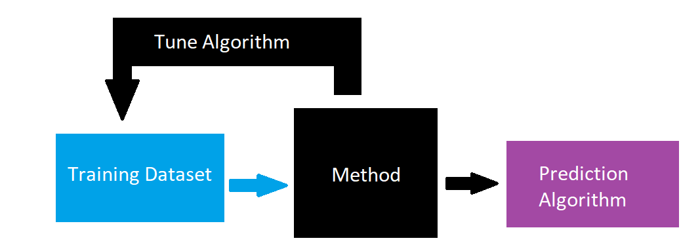

```{r setup, include=FALSE}
knitr::opts_chunk$set(echo = TRUE, message = FALSE, warning = FALSE,
                      fig.width = 6, fig.height = 3)
```

```{r packages, include=FALSE, echo=FALSE}
library(tidyverse)
library(caret)
library(rmarkdown)
library(DMwR)
library(summarytools)
library(randomForest)
library(pROC)
```

```{r, include=FALSE, echo=FALSE}
ibis_data <- read_csv("../data/fyi_data.CSV") %>%
  filter(grepl("HR", `HR ASD versus HR_Neg`)) %>%
  mutate(asd_group = ifelse(Groups=="HR_ASD", "HR_ASD", "HR_Neg"))

ibis_data <- ibis_data %>%
  select(FYIq_1:FYIq_60, asd_group) %>%
  mutate(asd_group = factor(asd_group))
```

# Review

- Homework 7 due on Saturday by 11PM EST

# Supervised Learning

- **Recall**: Train algorithm based on data with observed classes
- Training done based on minimizing error/maxing accuracy
- $\rightarrow$ driven by **majority class** if large imbalance
  
<center>
  <figure>
    
  </figure>
</center>

# Imbalanced Data

- **Recall**: IBIS dataset
- Low number of infants with autism spectrum disorder (ASD)
- **Still important to predict this group well** (cost of missing them is high!)

```{r}
freq(ibis_data$asd_group, order="freq", totals = FALSE, cumul =FALSE)
```

# Analytic Methods

- From homework, know that low frequency class can be tough

```{r}
tt_indices <- createDataPartition(y=ibis_data$asd_group, p=0.6, list = FALSE)

train_data <- ibis_data[tt_indices,]
test_data <- ibis_data[-tt_indices,]

freq(train_data$asd_group, order="freq", totals = FALSE, cumul =FALSE)
freq(test_data$asd_group, order="freq", totals = FALSE, cumul =FALSE)

# Use random forest for example
rf_fit <- randomForest(formula = asd_group~., data = train_data)

test_predict <- predict(rf_fit, newdata = test_data)

# Confusion matrix
confusionMatrix(data=test_predict, reference=test_data$asd_group)
```

# Analytic Methods

- What to do?
- Main methods:
  1. Weighting observations
  2. Super-sampling
  
# Weighting

- By default, each obs gets same weight $\rightarrow$ contribute to error the same amount
- But, **error in predicting one type may have higher cost then for other type**
- Can implement this using chosen weights

- Ex. linear regression
  - No weights

$$
\hat{y} = \underset{\beta}{\mathrm{argmin}}\sum_{i=1}^n(y_i-\beta x_i)^2
$$

  - Weights
  
$$
\begin{align}
& \hat{y}_w = \underset{\beta}{\mathrm{argmin}}\sum_{i=1}^nw_i(y_i-\beta x_i)^2 \\
& \text{where } \{w_i\}_{i=1}^n \text{ are subject-specific weights}
\end{align}
$$

- Common choice for weights: *inverse probability weighting*

$$
\begin{align}
& w_i = 1/\hat{\pi}_k \text{ for } k=1,\ldots, K \\
& \text{where } \hat{\pi}_k=\sum_{i=1}^{n} I(i \text{ in group } K)/n
\end{align}
$$

  - Those in rare groups get **high weight**, cost for their error is high
  
# Weighting

- With `caret` can implement in `train` function (`weights` argument)

```{r}
tt_indices <- createDataPartition(y=ibis_data$asd_group, p=0.6, list = FALSE)

ibis_data <- data.frame(lapply(ibis_data, as.factor))

train_data <- ibis_data[tt_indices,]
test_data <- ibis_data[-tt_indices,]

freq(train_data$asd_group, order="freq", totals = FALSE, cumul =FALSE)
freq(test_data$asd_group, order="freq", totals = FALSE, cumul =FALSE)

# Compute weights
freq_table <- freq(train_data$asd_group, order="freq", totals = FALSE, cumul =FALSE)
props <- freq_table[,"% Total"]
props <- ifelse(train_data$asd_group=="HR_Neg", props["HR_Neg"]/100,
                  props["HR_ASD"]/100)
model_weights <- 1/props
ftable(round(model_weights, 3))
ftable(train_data$asd_group)

# Use random forest for example
rf_fit <- train(asd_group~., data = train_data, 
                       method = "rf", weights = model_weights,
                trControl=trainControl(method="cv", number=2))

test_predict <- predict(rf_fit, newdata = test_data)

# Confusion matrix
confusionMatrix(data=test_predict, reference=test_data$asd_group)
```

# Supersampling

- Second idea: up/downsampling
- **Concept**: Why don't we up-sample the minority class (down-sample the majority)
  - **Note**: Still need predictor distributions in *synthetic* training set to be maintained
    - Why?
  - **Leave test set alone, only create a synthetic sample from the training set**
    - Why?
- Most common method: SMOTE

<center>
  <figure>
    
  </figure>
</center>

# Supersampling

- Common method: `DmWR` package
- **However**, package has been removed from CRAN
- Alternatives:

```{r}
tt_indices <- createDataPartition(y=ibis_data$asd_group, p=0.6, list = FALSE)

ibis_data <- data.frame(lapply(ibis_data, as.factor))

train_data <- ibis_data[tt_indices,]
test_data <- ibis_data[-tt_indices,]

freq(train_data$asd_group, order="freq", totals = FALSE, cumul =FALSE)
freq(test_data$asd_group, order="freq", totals = FALSE, cumul =FALSE)

# SMOTE training set AFTER creating train and test sets
train_smote <- SMOTE(asd_group~., data=train_data, perc.under = 150)
freq(train_smote$asd_group, order="freq", totals = FALSE, cumul =FALSE)

# Use random forest for example
rf_fit <- train(asd_group~., data = train_smote, 
                       method = "rf",
                trControl=trainControl(method="cv", number=2))

test_predict <- predict(rf_fit, newdata = test_data)

# Confusion matrix
confusionMatrix(data=test_predict, reference=test_data$asd_group)

# Try changing prob threshold using ROC
train_roc <- roc(predictor=predict(rf_fit, newdata=train_smote, type="prob")[,1], 
                 response=train_smote$asd_group)
plot(train_roc)
roc_thresh <- coords(train_roc, "best", "threshold")
test_predict_probs <- predict(rf_fit, newdata = test_data, type="prob")[,1]
test_predict_edit <- factor(ifelse(test_predict_probs>roc_thresh$threshold, "HR_ASD", "HR_Neg"))
confusionMatrix(data=test_predict_edit, reference=test_data$asd_group)
```

# Supersampling

- Caveats:
  - SMOTE requires **some** numeric predictors to determine ''neighborhoods'' to draw samples
    - **Ad hoc**: convert categorical to numeric
    - May be suboptimal (**Why?**)
  - Can be difficult to select ROC-based threshold from training set after SMOTE
    - Sometimes threshold chosen from test set, **but this is suboptimal!**


  
  


