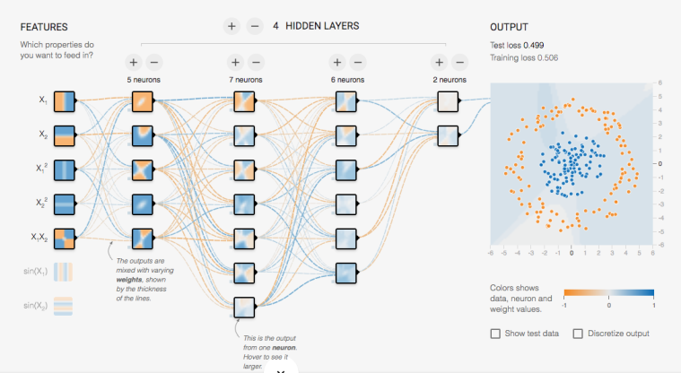
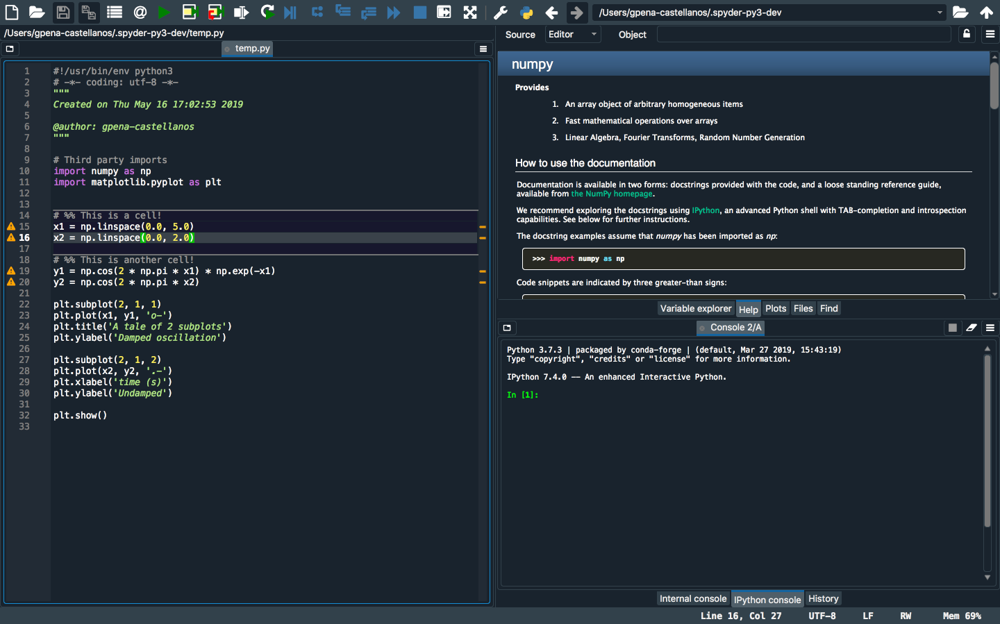
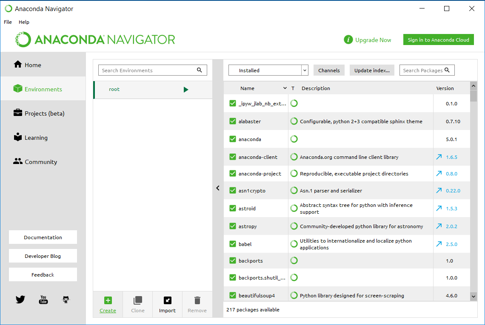
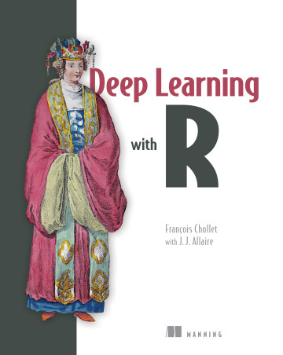
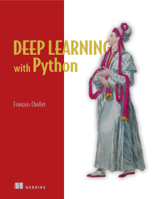

```{r setup, include=FALSE}
knitr::opts_chunk$set(echo = TRUE, message = FALSE, warning = FALSE,
                      fig.width = 6, fig.height = 3)
```

```{r packages, include=FALSE, echo=FALSE}
library(tidyverse)
library(caret)
library(rmarkdown)
```

# Deep Learning

<center>
  <figure>
    
  </figure>
</center>

# Deep Learning

- We've discussed deep learning conceptually, but how do we implement?
- Main packages: `TensorFlow` and `Keras` in **Python**
- **Python** is a general computing language with packages to add-in stats functionality 
  - Packages: `pandas`, `numpy`, `scipy`, ...

<center>
  <figure>
    
  </figure>
</center>

# Python

:::: {style="display: flex;"}

::: {}
- Object-Oriented Programming Language (similar to R)
- Main IDE: Spyder
:::

::::

:::: {style="display: flex;"}

::: {}
<figure>
    
</figure>
:::

::: {}
<figure>
    
</figure>
:::

::::

# Python

- Keeping track of packages and which are installed is cumbersome in Python
- Solution: `Anaconda`
  - Create *environments*
  
<center>
  <figure>
    
  </figure>
</center>

# Live Python Example
- See video lecture

# Deep Learning in R

:::: {style="display: flex;"}

::: {}
- Luckily, `TensorFlow` and `Keras` have been officially ported to R
  - https://tensorflow.rstudio.com/
  - https://keras.rstudio.com/
:::

::::

:::: {style="display: flex;"}

::: {}
<figure>
    
</figure>
:::

::: {}
<figure>
    
</figure>
:::

::::
