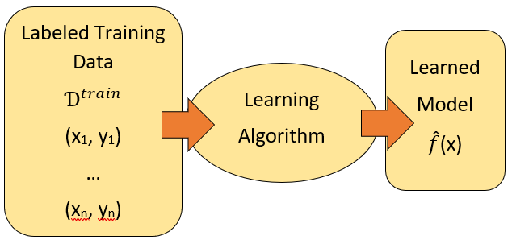
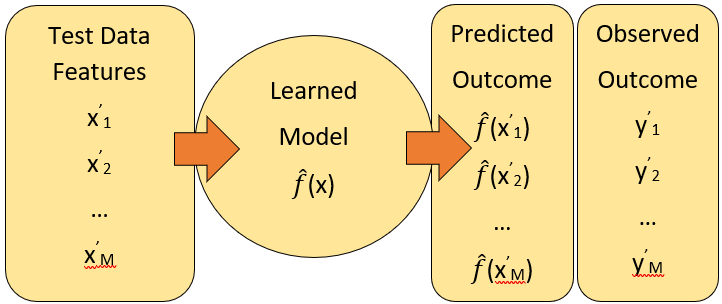
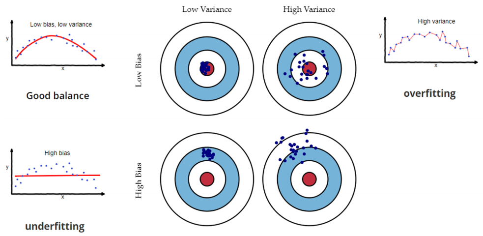
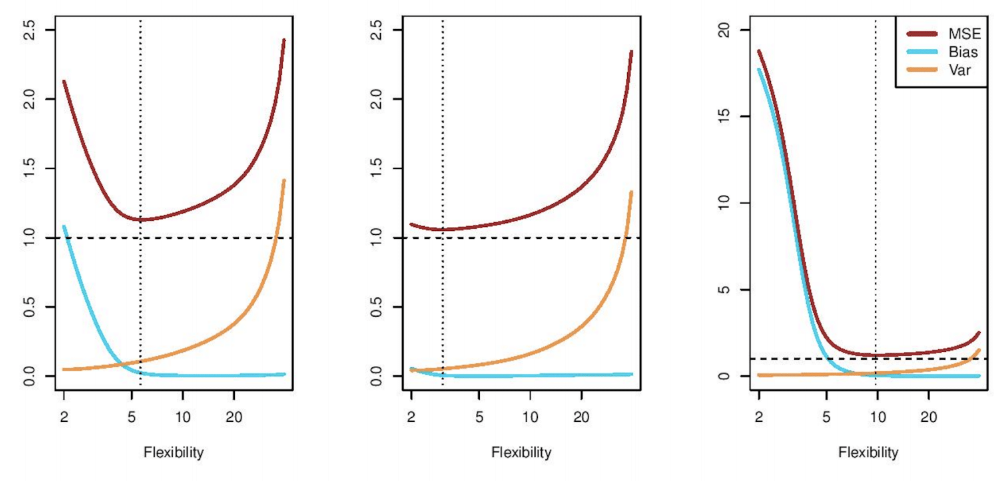
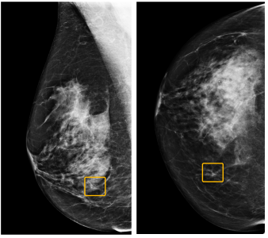
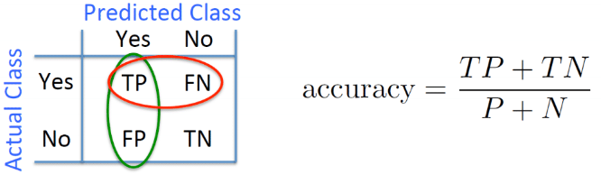
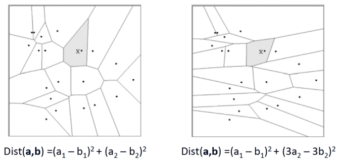
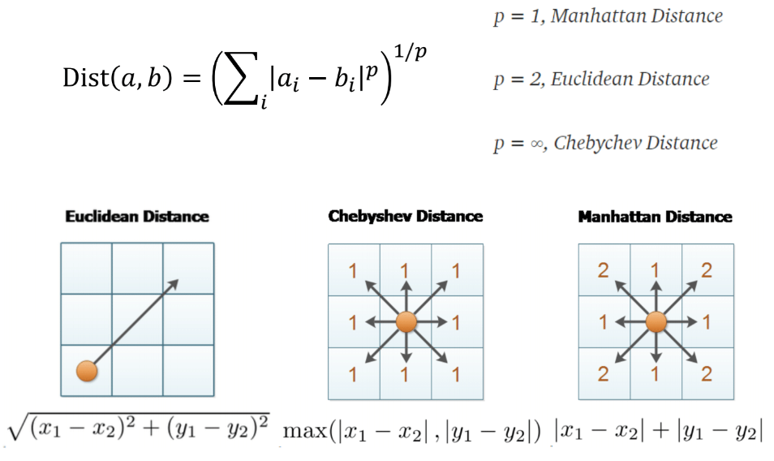
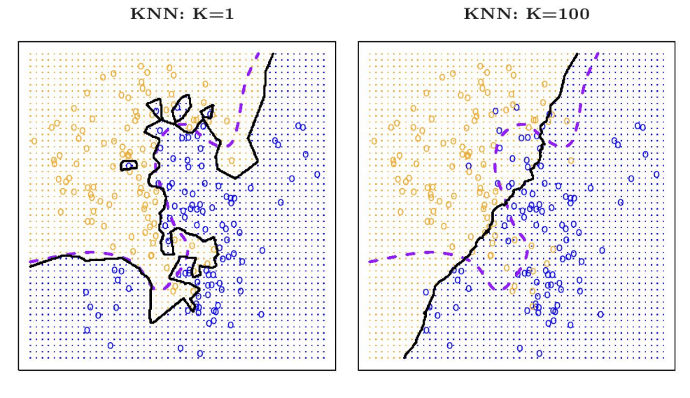
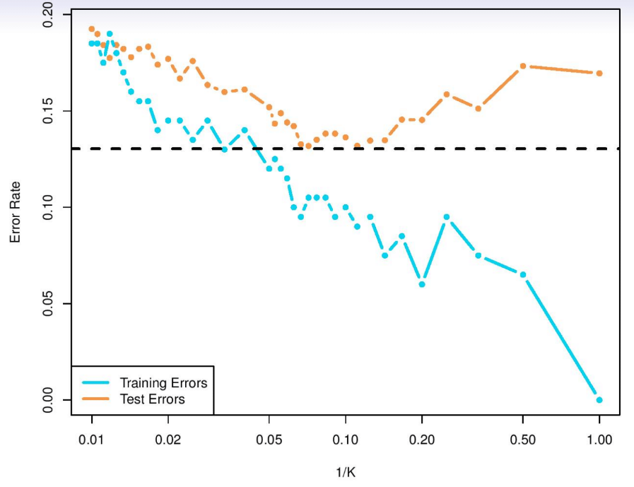

```{r setup, include=FALSE}
knitr::opts_chunk$set(echo = FALSE, message = FALSE, warning = FALSE,
                      fig.width = 11, fig.height = 4)
```

```{r packages, include=FALSE}
library(tidyverse)
library(ggpubr)
library(scales)
library(broom)
library(flextable)
library(scatterplot3d)
library(rgl)
library(caret)
```

# Review

- Homework 1 assigned, due on 1/28 at 11PM through GitHub Classroom
- Article Evaluation 1 assigned, due on 2/2 through GitHub Classroom
- Office Hours: Wednesday 10-11AM
- Last week: discussed supervised and unsupervised learning, curse of dimensionality, evaluating model performance

# Supervised Learning

- Features: 
$$
X=
\left(\begin{array}{c} 
X_1 \\
X_2 \\
... \\
X_p
\end{array}\right)
$$ 

- Model:
$$Y = f(X) + \epsilon$$

- Goals
  - Define $f(X)$; e.g. $f(X)=E(Y|X=x)$
  - Model and estimate $f(X)$, denoted $\hat{f}(x)$
  - Define metric to evaluate estimated model; e.g. $\hat{MSE}(x) = E[(Y-\hat{f}(X))^2|X=x]$

# Supervised Learning
<center>
<figure>
    
</figure>
</center>

- Give learner training data
- Learner returns model $\hat{f}(x)$

# Supervised Learning
<center>
<figure>
    
</figure>
</center>

- Give test data estimated model $\hat{f}(x)$
- Compare predicted outcomes from $\hat{f}(x)$ with observed

# Mean Squared Error Decomposition
**Recall**:
$MSE$ for estimate at $X=x$ can be decomposed into $$MSE_{\hat{f}}(x)=E[(Y-\hat{f}(X))^2|X=x]=[f(x)-\hat{f}(x)]^2+Var(\epsilon)$$

Consider taking expectation marginally (i.e., across $Y$ and $X$).

Can show $$E[(Y-\hat{f}(X))^2]=E_x[\text{bias}(\hat{f}(x))^2]+E_x[\text{Var}(\hat{f}(x))]+\text{Var}(\epsilon)$$

where $\text{bias}(\hat{f}(x))=\text{E}[\hat{f}(x)]-f(x)$

# Bias-variance trade-off
Above means bias **and** variance of model increases expected model error

Creates tradeoff:

- Higher complexity: **decreased** bias but **increased** variance
- Lower complexity: **increased** bias but **decreased** variance
<center>
<figure>
    
</figure>
</center>

# Bias-variance trade-off
<center>
<figure>
    
</figure>
</center>

# Classification
Suppose instead response $Y$ is categorical

e.g. cancer stage is one of $C=(0, 1, 2, 3, 4)$ where $0$ indicates cancer-free

**Goals**:

- Build classifier $\hat{f}(X)$ that maps a category from $C$ to future observation $X$
- Assess uncertainty in each classification
- Understand roles of predictions $X=(X_1, X_2, \ldots, X_p)$

<center>
<figure>
    
</figure>
</center>

# Classification
**What to model?**:

Let $p_k(x)=\text{Pr}(Y=k|X=x)$, $k=1,2,\ldots,K$

Denoted as the **conditional class probabilities** at $x$

If these are known, can define classifier at $x$ by

$f(x)=j$ if $p_j(x)=\text{max}[p_1(x), \ldots, p_K(x)]$

Denoted as the **Bayes optimal classifier** at $x$

<center>
<figure>
    
</figure>
</center>

# Classification metrics

**Basic**:

$\text{accuracy}=\frac{\text{# correct predictions}}{\text{# test instances}}$

$\text{error}=1-\text{accuracy}$

These are in general **not sufficient** (why?)

# Confusion Matrix
<center>
<figure>
    
</figure>
</center>

- Want to correctly identify positive **and** negative instances accurately
- For positive instances, have the following metrics:
\begin{align}
\color{green}{PPV=\frac{TP}{TP+FP}} && \color{red}{Sensitivity=\frac{TP}{TP+FN}} && F_1=\frac{2}{\frac{1}{PPV}+\frac{1}{Sensitvity}}
\end{align}

# Confusion Matrix
**Example**

During the COVID-19 pandemic, different metrics to quantify risk:

```{r echo=FALSE, out.width="60%", out.height="20%",fig.show='hold', fig.align='center'}
knitr::include_graphics(c("images/coronavirus-data-explorer.png",
                          "images/covid_deaths_per_capita.jpeg"))
```

# K-nearest Neighbor (KNN)

**Simple** and **flexible** algorithm:
<center>
<figure>
    
</figure>
</center>

# Distance Metrics

- Different metrics can dramatically change neighborhoods:
<center>
<figure>
    
</figure>
</center>

- Standard Euclidean distance metric:
  - 2D: $\text{Dist}(a,b)=\sqrt{[(a_1-b_1)^2+(a_2-b_2)^2]}$
  - Multdim: $\text{Dist}(a,b)=\sqrt{\sum{(a_i-b_i)^2}}$
  
# Distance Metrics
<center>
<figure>
    
</figure>
</center>

# KNN Examples
1. Regression
- Suppose we want to predict the number of wins for a NBA team
```{r echo=FALSE}
team_data <- read_csv(file = "../data/nba_teams_19_20.csv") %>%
  mutate(playoffs = ifelse(grepl("\\*", Team)==TRUE, "yes", "no"),
         Team = gsub("\\*", "", Team)) %>%
  filter(Team!="League Average") %>%
  select(W, ORtg, DRtg)

knnFit <- train(W ~ ., data = team_data, method = "knn", preProcess = c("center","scale"), tuneLength = 20)

knnFit
```

# KNN Examples
2. Classification
- Suppose we want to predict whether a NBA team made the playoffs

```{r echo=FALSE}
team_data <- read_csv(file = "../data/nba_teams_19_20.csv") %>%
  mutate(playoffs = ifelse(grepl("\\*", Team)==TRUE, "yes", "no"),
         Team = gsub("\\*", "", Team)) %>%
  filter(Team!="League Average") %>%
  select(playoffs, ORtg, DRtg)

knnFit <- train(playoffs ~ ., data = team_data, method = "knn", preProcess = c("center","scale"), tuneLength = 20)

knnFit

lgrid <- expand.grid(ORtg=seq(105, 120, by=0.5), 
                     DRtg=seq(102, 120, by=0.5))

knnPredGrid <- predict(knnFit, newdata=lgrid)
knnPredGrid = as.numeric(knnPredGrid) 

ortg = seq(105, 120, by=0.5)
drtg = seq(102, 120, by=0.5)

probs <- matrix(knnPredGrid, length(ortg), 
                 length(drtg))

contour(ortg, drtg, probs, labels="", xlab="ORTG", ylab="DRTG", main=
          "X-nearest neighbour", axes=FALSE)

gd <- expand.grid(x=ortg, y=drtg)

points(gd, pch=".", cex=5, col=probs)
box()   
```

# KNN Examples
<center>
<figure>
    
</figure>
</center>

# Train and Test Error
<center>
<figure>
    
</figure>
</center>