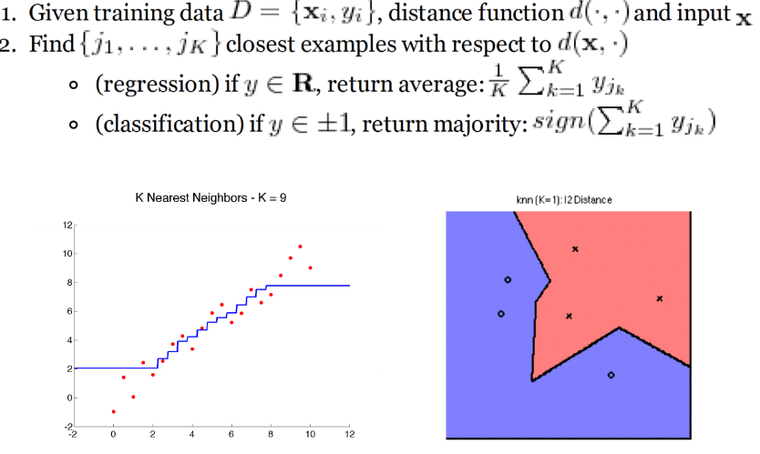
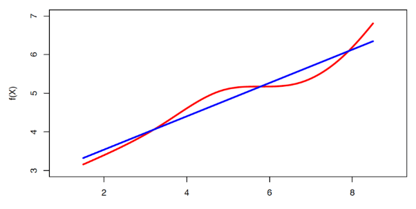
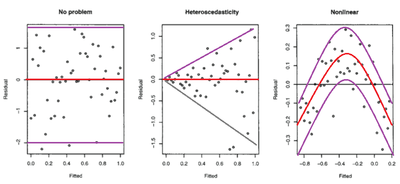
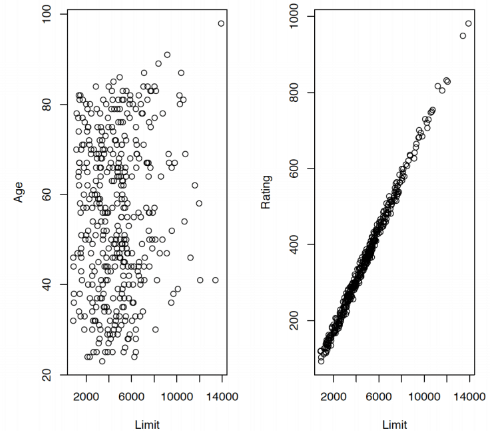
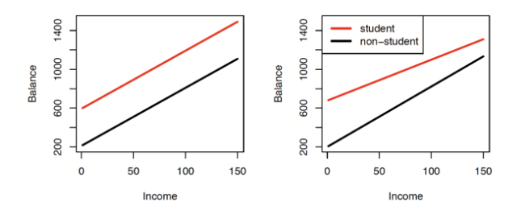
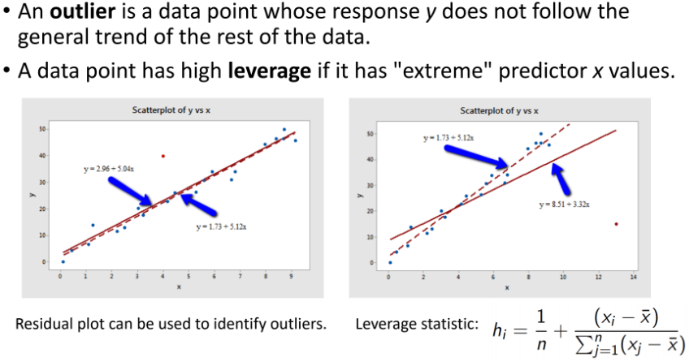

```{r setup, include=FALSE}
knitr::opts_chunk$set(echo = FALSE, message = FALSE, warning = FALSE,
                      fig.width = 6, fig.height = 3)
```

```{r packages, include=FALSE}
library(tidyverse)
library(ggpubr)
library(scales)
library(broom)
library(flextable)
library(scatterplot3d)
library(rgl)
library(caret)
library(reshape2)
```

# Review

- Homework 1 due on today at 11PM through GitHub Classroom
- Article Evaluation 1 assigned, due on 2/9 through GitHub Classroom
- Last lecture: discussed bias and variance trade-off, classification, k-nearest neighbor

# K-nearest Neighbor (KNN)

**Simple** and **flexible** algorithm:
<center>
<figure>
    
</figure>
</center>

# KNN Examples: Regression

- Suppose we want to predict chance at getting admitted to graduate school based on
  - GRE (GRE Score)
  - GPA (CGPA)
  
- First, we **don't split the data**

```{r}
student_data_full <- read_csv(file = "../data/grad_admissions/Admission_Predict.csv") 

student_data <- student_data_full%>%
  select(`Chance of Admit`, `GRE Score`, CGPA) %>%
  plyr::rename(c("Chance of Admit"="admit",
                 "GRE Score"="gre"))
```

```{r echo=TRUE, fig.width = 8, fig.height = 4}
knnFit <- train(admit ~ ., data = student_data, method = "knn", tuneLength = 20)

# Look at tuning results
knnFit
plot(knnFit)
```

# KNN Examples: Regression

```{r fig.width = 10, fig.height = 6}
# Add in predicted values at "best" tuning value
student_data$knn_pred_admit <- predict(knnFit)

# Compute RMSE
paste0("RMSE=",
       round(sqrt(mean((student_data$knn_pred_admit-student_data$admit)^2)), 7))

# Plot predicted values
ggarrange(plotlist=
            list(ggplot(data=student_data, mapping=aes(x=gre, y=CGPA, color=knn_pred_admit))+
                   geom_point()+
                   theme_classic()+
                   labs(title="Predicted Values"),
                 ggplot(data=student_data, mapping=aes(x=gre, y=CGPA, color=admit))+
                   geom_point()+
                   theme_classic()+
                   labs(title="Actual Values")),
nrow=1)
```

# KNN Examples: Regression

- Split the data into training and testing portion 
- 60:40 split used

```{r echo=TRUE, fig.width = 8, fig.height = 4}
student_data <- student_data %>% select(-knn_pred_admit)

set.seed(12)
student_data_tt_index <- createDataPartition(student_data$admit, p=0.6, list = FALSE)
student_data_train <- student_data[student_data_tt_index,]
student_data_test <- student_data[-student_data_tt_index,]

knnFit <- train(admit ~ ., data = student_data_train, method = "knn", tuneLength = 20)

# Look at tuning results
knnFit
plot(knnFit)

```

# KNN Examples: Regression

```{r fig.width = 10, fig.height = 6}
# Add in predicted values at "best" tuning value
student_data_test$knn_pred_admit <- predict(knnFit, newdata = student_data_test)

# Compute RMSE
paste0("Test RMSE=",
       round(sqrt(mean((student_data_test$knn_pred_admit-student_data_test$admit)^2)), 7))

# Plot predicted values
ggarrange(plotlist=
            list(ggplot(data=student_data_test, mapping=aes(x=gre, y=CGPA, color=knn_pred_admit))+
                   geom_point()+
                   theme_classic()+
                   labs(title="Predicted Values"),
                 ggplot(data=student_data_test, mapping=aes(x=gre, y=CGPA, color=admit))+
                   geom_point()+
                   theme_classic()+
                   labs(title="Actual Values")),
nrow=1)
```

# Linear Regression

- Let's model the relationship between $Y$ and $X_1, \ldots, X_p$
  - Model: $Y=\beta_0+\beta_1X_1+\ldots+\beta_pX_p+\epsilon$
  - Simple, but very flexible and generalizable
  - True trend never linear, but may be **good approximation**
  
<center>
<figure>
    
</figure>
</center>

# Simple Linear Regression

- **Model**: $Y=\beta_0+\beta_1X+\epsilon$
  - $\beta_0$, $\beta_1$ are *coefficients* or *parameters*
  - $\epsilon$ is *error*
- **Idea**: estimate trend by estimating parameters
  - Estimates = $\hat{\beta_0}, \hat{\beta_1}$
  - Predict $Y$ using estimated trend: $\hat{Y}=\hat{\beta_0}+\hat{\beta_1}x$
  - How to estimate?
  
# Simple Linear Regression: Estimation

- Estimation by **least squares**
  - Suppose $\hat{\beta_0}, \hat{\beta_1}$ is a possible estimate
  - Suppose we observe data $\{(x_1, y_1), \ldots, (x_n,y_n)\}$
  - For above estimates, define *residuals* $e_i=y_i-(\hat{\beta_0}+\hat{\beta_1}x_i)$
  - Define *residual sum of squares* (RSS) as
  $RSS=\sum_{i=1}^{n}(e_i)^2$
  - **Goal**: Choose $\hat{\beta_0}, \hat{\beta_1}$ which minimizes $RSS$
  
```{r}
x <- rnorm(100, mean=3)
e <- rnorm(100, sd=2)
y <- 1+x+e
pred <- 1+x
data <- data.frame("x"=x, "y"=y, "pred"=pred)

ggplot(data=data, mapping=aes(x=x, y=y))+
  geom_point(color="red")+
  geom_segment(aes(xend = x, yend = pred))+
  geom_line(aes(y=pred), color="blue")+
  theme_classic()
```

# Simple Linear Regression: Estimation

- In case with one feature, can show
$$
\begin{align}
\hat{\beta_1}&=\frac{\sum_{i=1}^{n}(X_i-\bar{X})(Y_i-\bar{Y})}{\sum_{i=1}^{n}(X_i-\bar{X})^2} \\
&=r_{xy}\frac{\hat{\sigma_y}}{\hat{\sigma_x}}\\
\\
\hat{\beta_0}&=\bar{Y}-\hat{\beta_1}\bar{X}
\end{align}
$$

where $\bar{Y}=\frac{1}{n}\sum_{i=1}^{n}Y_i$ and $\bar{X}=\frac{1}{n}\sum_{i=1}^{n}X_i$

# Assessing Variability of Estimates
- *Standard error*(SE) of estimator = variability across repeated samples
- Denoting $\text{Var}(\epsilon)=\sigma^2$
$$
\begin{align}
&\text{SE}(\hat{\beta_1})=\sqrt{\frac{\sigma^2}{\sum_{i=1}^{n}(X_i-\bar{X})}}\\ &\text{SE}(\hat{\beta_0})=\sqrt{\sigma^2\Big[\frac{1}{n}+\frac{\sigma^2}{\sum_{i=1}^{n}(X_i-\bar{X})}\Big]}
\end{align}
$$

- *Confidence intervals* (CI): for $\beta_j$ for $j=0,1$
$$
\hat{\beta_j} \pm z_{1-\alpha/2}*\text{SE}(\hat{\beta_j})
$$
  - Ex. For $95\%$ CI, $\alpha=0.05$ with $z_{0.975}=1.96$
  - Never know $\sigma^2$ thus need to replace in formulas with estimate $\hat{\sigma^2}$
  - Results in **estimates** $\hat{SE}(\hat{\beta_j})$ with $t_{n-2, 1-\alpha/2}$ used
  
# Hypothesis Testing
- SEs also used to perform *hypothesis tests* on coefficients
- Ex. Test the *null hypthesis* of
  - $H_0$: There is no relationship between $X$ and $Y$
  - Alternative $H_1$: There is **some** relationship between $X$ and $Y$
- Mathematically, this corresponds to 
  - $H_0$: $\beta_1=0$
  - $H_1$: $\beta_1 \neq 0$

# Test Statistic
- To test null vs alternative, need to aggregate data into *test statistic*
  - Then compare statistic value to it's distribution under $H_0$
  - For linear regression, test statistic is
  
$$
T=\frac{\hat{\beta_1}-0}{\hat{SE}(\hat{\beta_1})}  
$$
  
  - $T$ has a $t$-distriubtion with $n-2$ degrees of freedom under null
  - Can compute probability of observing $|T|\geq |t|$ in sample
    - Denoted as *p-value*

# Model Assumptions
- Note that above **distribution** for test statistic only hold if 
  1. Usual linear regression **assumptions met**:
      - Homoskedasicity
      - Independent residuals
      - **and** one of the following
  2. Normally distributed residuals
  3. Large sample approximation
  
<center>
<figure>
    
</figure>
</center>

# Assessing Model Accuracy
- *Residual Standard Error*
$$
RSE=\sqrt{\frac{1}{n-2}RSS} \\
\text{where } RSS=\sum_{i=1}^{n}(y_i-\hat{y_i})^2
$$
- *R^2* or "fraction of variance accounted for"
$$
R^2=\frac{TSS-RSS}{TSS} \\
\text{where } TSS=\sum_{i=1}^{n}(y_i-\bar{y})^2
$$
$TSS$ is the *total sum of squares*

# Multiple Linear Regression

- Model is
$$
Y=\beta_0+\beta_1X_1+\ldots+\beta_pX_p+\epsilon
$$
- **Interpretation**:
  - $\beta_j$ is *mean* change in $Y$ after a one unit increase in $X_j$, holding other $X$ fixed
- For the graduate student admissions example:
  - `admit` = $\beta_0$ + $\beta_1$`GRE` + $\beta_2$`GPA` + $\epsilon$
- **Estimation**:
  - Again, least squares
  - $RSS=\sum_{i=1}^{n}(e_i)^2=\sum_{i=1}^{n}(y-\hat{\beta_0}-\hat{\beta_1}X_1-\ldots-\hat{\beta_p}X_p)^2$

# Collinearity
- Two or more predictors have **high correlation** with each other
- Implying holding one constant while varying others not possible in data
- Can result in **poor estimation**

<center>
<figure>
    
</figure>
</center>

# Example 

- Let's use regression instead of KNN to predict admission chance
- Model: `admit` = $\beta_0$ + $\beta_1$`GRE` + $\beta_2$`GPA` + $\epsilon$

```{r, echo=TRUE}
lm_fit <- lm(formula = admit~., data=student_data)
tidy(lm_fit) %>%
  mutate(p.value=ifelse(p.value<0.005, "<0.005", 
                        as.character(round(p.value, 2)))) %>%
  flextable()
```

# Example 

- Let's look at the correlation matrix to assess **collinearity**

```{r, fig.width = 10, fig.height = 6}
cor_matrix <- melt(round(cor(x=as.matrix(student_data), y=as.matrix(student_data)),2))

ggplot(cor_matrix, aes(Var2, forcats::fct_rev(Var1), fill = value))+
 geom_tile(color = "white")+
 scale_fill_gradient2(low = "blue", high = "red", mid = "white", 
                      midpoint = 0, limit = c(-1,1), space = "Lab", 
                      name="Pearson\nCorrelation") +
 coord_fixed()+
 geom_text(aes(Var2, Var1, label = value), color = "white", size = 8)+
 labs(x="", y="")+
 theme_minimal()+ 
 theme(axis.text.x = 
         element_text(angle = 45, vjust = 1, 
                      size = 20, hjust = 1),
       axis.text.y = 
         element_text(size = 20))
```

# Qualitative Predictors

- **Quantitative**: $\beta$ assess change in mean $Y$ when $X$ **changes by 1 unit**
- How do this work with variables indicating **categories**?
- Ex. Consider $X=0$ or 1
  - Model: $Y=\beta_0+\beta_1X$
  - Change in $X$ of 1 unit = change from category "0" to category "1"
- What about multi-category $X$?
  - Ex. Consider $X=0, 1$ or 2
  - Change in $X$ of 1 unit = change from category "x" to category "x+1"
  - Assumes same level of change from 0 to 1, 1 to 2
  - Unrealistic for **nominal** variables
  
# Qualitative Predictors: Dummy Coding

- $X$ with $M$ categories $(0, 1, \ldots, M)$ create $M-1$ features
- One is *reference level*, denoted by **all dummy features = 0**
- Ex. Graduate Admissions
  - Model: $admit = \beta_0 + \beta_1prestige + \epsilon$
  - Suppose $prestige$ is categorical ("low", "medium", "high")
  - Model: $admit = \beta_0 + \beta_1prestige_1 + \beta_2prestige_2 + \epsilon$
  
$$
\begin{align}
&prestige_1 = \begin{cases} 
      1 & X=\text{medium} \\
      0 & \text{else} \\
   \end{cases}\\
&prestige_2 = \begin{cases} 
      1 & X=\text{high} \\
      0 & \text{else} \\
   \end{cases}\\
\end{align}
$$

# Qualitative Predictors: Dummy Coding

- Ex. Graduate admission data
  - Model: $admit = \beta_0 + \beta_1prestige_1 + \beta_2prestige_2 +\beta_3prestige_3 +\beta_4prestige_4 + \epsilon$
  
```{r, echo=TRUE}
student_data <- student_data_full %>%
  mutate(`University Rating`=factor(`University Rating`-1)) %>%
  plyr::rename(c("Chance of Admit"="admit",
                 "University Rating"="prestige"))
  
lm_fit <- lm(formula = admit~prestige, data=student_data)
tidy(lm_fit) %>%
  mutate(p.value=ifelse(p.value<0.005, "<0.005", 
                        as.character(round(p.value, 2)))) %>%
  flextable()
```

# Interactions:

- **Recall**: In the graduate admission data model, we assumed GPA and GRE effected admissions **independently**
  - `admit` = $\beta_0$ + $\beta_1$`GRE` + $\beta_2$`GPA` + $\epsilon$
  - Change in average `admit` from one unit change in `GRE` always $\beta_1$
  - Perhaps GRE matters more for admission chance among certain GPA ranges?
  - Referred to as an *interaction* between these features
  
# Interactions:

- Ex. 1: Two continuous features
  - Model: 
  
$$
\begin{align}
admit &= \beta_0 + \beta_1GRE + \beta_2GPA + \beta_3GRE*GPA+ \epsilon \\
&= \beta_0 + (\beta_1+\beta_3GPA)*GRE + \beta_2GPA + \epsilon \\
&= \beta_0 + \beta_1GRE + (\beta_2+\beta_3GRE)*GPA + \epsilon
\end{align}
$$

- Ex. 2: Continuous and categorical feature
  - Model: Suppose we look at research experience ("No" or "Yes") and GPA
  - $admit = \beta_0 + \beta_1Research + \beta_2GPA + \beta_3Research*GPA+ \epsilon$
  
```{r, echo=TRUE}
# Center CGPA
student_data <- student_data %>%
  mutate(CGPA_c = CGPA - mean(student_data$CGPA))

lm_fit <- lm(formula = admit~Research+CGPA_c+Research*CGPA_c, data=student_data)
tidy(lm_fit) %>%
  mutate(p.value=ifelse(p.value<0.005, "<0.005", 
                        as.character(round(p.value, 2)))) %>%
  flextable()

# Compare R2 without interaction
lm_fit_no_int <- lm(formula = admit~Research+CGPA_c, data=student_data)
r2_no_int <- round(summary(lm_fit_no_int)$r.squared, 3)
r2_int <- round(summary(lm_fit)$r.squared, 3)
```

  - $R^2$ for interaction model is `r r2_int` compared to `r r2_no_int` without the interaction
  
# Interactions:

- Ex. 2: Continuous and categorical feature
  - No interaction term
  
$$
\begin{align}
admit &\approx \beta_0 + \beta_1Research + \beta_2GPA\\
&=\beta_2GPA+\begin{cases} 
      \beta_0  & Research=\text{No} \\
      \beta_0 + \beta_1 & Research=\text{Yes} \\
   \end{cases}\\
\end{align}
$$

  - With interaction term
  
$$
\begin{align}
admit &\approx \beta_0 + \beta_1Research + \beta_2GPA + \beta_3Research*GPA\\
&=\begin{cases} 
      \beta_0 +\beta_2GPA & Research=\text{No} \\
      (\beta_0 + \beta_1) + (\beta_2+\beta_3)GPA & Research=\text{Yes} \\
   \end{cases}\\
\end{align}
$$

<center>
<figure>
    
</figure>
</center>

# Outliers and High Leverage Points

<center>
<figure>
    
</figure>
</center>