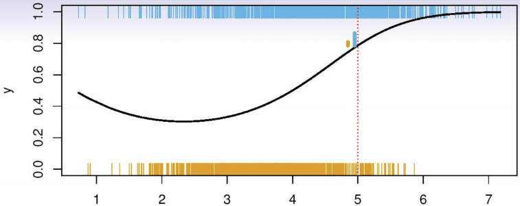
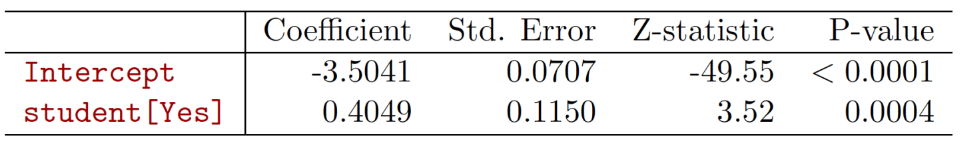
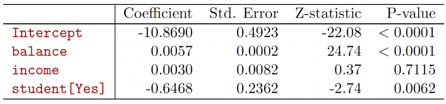
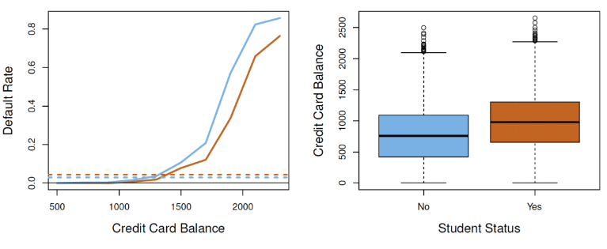
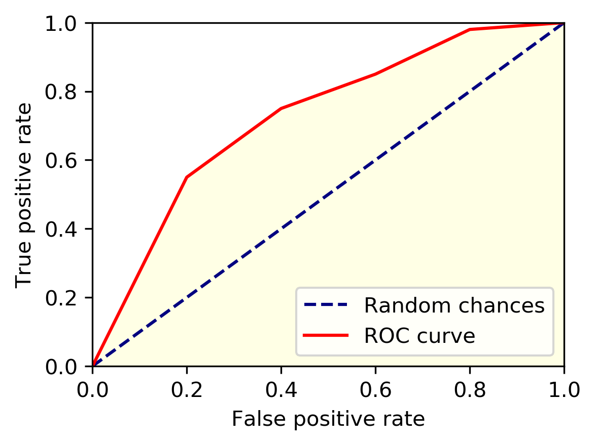
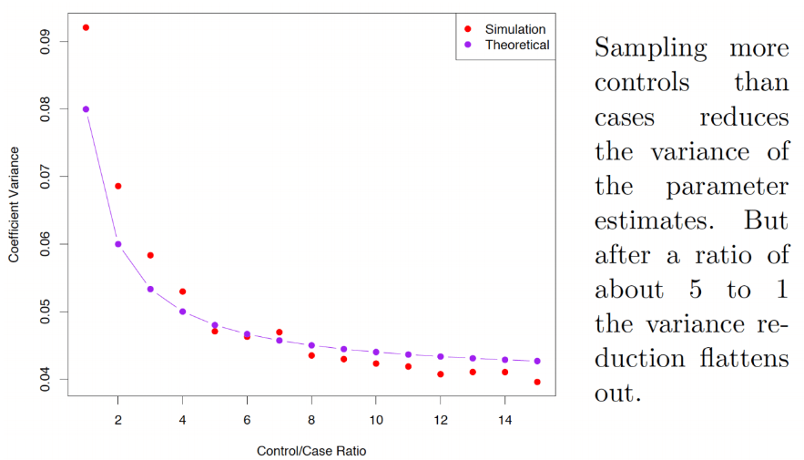
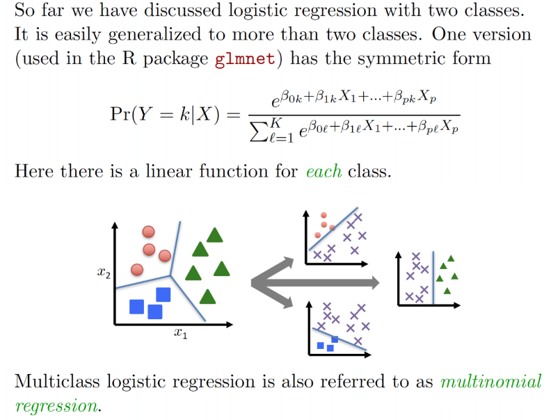

```{r setup, include=FALSE}
knitr::opts_chunk$set(echo = FALSE, message = FALSE, warning = FALSE,
                      fig.width = 6, fig.height = 3)
```

```{r packages, include=FALSE}
library(tidyverse)
library(ggpubr)
library(scales)
library(broom)
library(flextable)
library(scatterplot3d)
library(rgl)
library(caret)
library(reshape2)
library(GGally)
library(pROC)
```

# Review

- Homework 2 due on 2/4 at 11PM through GitHub Classroom
- Article Evaluation 1 assigned, due on 2/9 through GitHub Classroom
- Last lecture: discussed k-nearest neighbor and linear regression

# Classification

Let response $Y \in \{0,1\}$ 

**Goal**: Predict $Y$ using features $X$

**What to model?**:

Let $p_k(x)=\text{Pr}(Y=k|X=x)$, $k=0,1$

Denoted as the **conditional class probabilities** at $x$

<center>
<figure>
    
</figure>
</center>

# Example: Heart Disease

**Goal**: Predict diagnosis of heart disease in patients

```{r fig.width = 12, fig.height = 4}
heart_data <- read_csv(file="../data/heart_disease/Correct_Dataset.csv") %>%
  mutate(heart_disease = 
           relevel(factor(ifelse(Target>0, "Yes", "No")), 
                   ref = "No"))

scatter <- 
  ggplot(data = heart_data, 
       mapping = aes(x=MAX_Heart_Rate, y=Age,
                     color=heart_disease, shape=heart_disease))+
  geom_point()+
  labs(x="Max Heart Rate", color="Heart Disease",
       shape="Heart Disease")+
  theme_classic()+
  theme(legend.position = "none")

box_heart_rate <-
  ggplot(data=heart_data, 
       mapping = aes(x=heart_disease, y=MAX_Heart_Rate,
                     fill=heart_disease))+
  geom_boxplot()+
  labs(x="Heart Disease", fill="Heart Disease",
       y="Max Heart Rate")+
  theme_classic()+
  theme(legend.position = "none")
  
box_age <-
  ggplot(data=heart_data, 
       mapping = aes(x=heart_disease, y=Age,
                     fill=heart_disease))+
  geom_boxplot()+
  labs(x="Heart Disease", fill="Heart Disease",
       y="Age (years)")+
  theme_classic()+
  theme(legend.position = "none")

ggarrange(plotlist=list(scatter, box_heart_rate, box_age),
          nrow = 1)
```

# Classification: Regression

**Recall**: Linear regression model

$Y=\beta_0+\beta_1X_1+\ldots+\beta_pX_p+\epsilon$

$E(Y|X)=\beta_0+\beta_1X_1+\ldots+\beta_pX_p$ as $\text{E}(\epsilon|X)=\text{E}(\epsilon)=0$

For binary $Y$, $\text{E}(Y|X)=\text{Pr}(Y=1|X)$

$\text{Pr}(Y=1|X)=\beta_0+\beta_1X_1+\ldots+\beta_pX_p$

Denoted *linear probability model*

**Limitation**: $0 \leq\text{Pr}(Y=1|X) \leq 1$ but linear function not constrained

# Classification: Regression

**Consider**:

Model probability of heart disease as function of max heart rate

```{r fig.width = 12, fig.height = 4}
heart_data <-
  heart_data %>%
  mutate(heart_disease_num = 
           ifelse(Target>0, 1, 0))
  
heart_data$prob_heart_disease_linear <-
  predict(lm(heart_disease_num~MAX_Heart_Rate, 
             data=heart_data))

heart_data$prob_heart_disease_logit <-
  predict(glm(heart_disease_num~MAX_Heart_Rate, 
              family=binomial(),
             data=heart_data))

heart_data <-
  heart_data %>%
  mutate(prob_heart_disease_logistic = 
         exp(prob_heart_disease_logit)/(1+exp(prob_heart_disease_logit)))

scatter_linear <- 
  ggplot(data = heart_data, 
       mapping = aes(x=MAX_Heart_Rate, y=heart_disease_num))+
  geom_point(aes(color=factor(heart_disease_num)))+
  geom_line(mapping=aes(y=prob_heart_disease_linear))+
  scale_y_continuous(breaks=seq(0, 1.2, 0.2))+
  labs(x="Max Heart Rate", y="Heart Disease",
       color="Heart Disease")+
  theme_classic()+
  theme(legend.position = "none")

scatter_logistic <- 
  ggplot(data = heart_data, 
       mapping = aes(x=MAX_Heart_Rate, y=heart_disease_num))+
  geom_point(aes(color=factor(heart_disease_num)))+
  geom_line(mapping=aes(y=prob_heart_disease_logistic))+
  scale_y_continuous(breaks=seq(0, 1.2, 0.2))+
  labs(x="Max Heart Rate", y="Heart Disease",
       color="Heart Disease")+
  theme_classic()+
  theme(legend.position = "none")

ggarrange(plotlist=list(scatter_linear, scatter_logistic),
          nrow = 1)
```

# Logistic Regression

**Model**: Single Feature $X$

$\text{logit}[p(Y=1|X)]=\beta_0+\beta_1X$

where $\text{logit}(p)=\text{ln}(\frac{p}{1-p})=\text{log}( \text{odds}[p(Y=1|X)])$

**In terms of conditional probability**:

$p(Y=1|X)=\frac{e^{\beta_0+\beta_1X}}{1+e^{\beta_0+\beta_1X}}$

```{r fig.width = 12, fig.height = 4}
logit <- function(x){
  log(x/(1-x))
}

exbit <- function(x){
  exp(x)/(1+exp(x))
}

x_domain_p <- seq(0, 1, by=0.01)

x_domain_p[x_domain_p==0] <- 0.01
x_domain_p[x_domain_p==1] <- 0.99

y_logit <- logit(x_domain_p)

x_domain_logit <- y_logit
y_exbit <- exbit(x_domain_logit)

plot_data <- data.frame(x_domain_p, y_logit, x_domain_logit, y_exbit)

prob_to_logit_plot <-
  ggplot(data=plot_data,
       mapping=aes(x=x_domain_p, y=y_logit))+
    geom_line()+
    xlab("Conditional Probability")+
    ylab("Logit")+
    labs(title = "Transforming probability to logit: logit(p)")+
    theme_classic()+
    theme(text = element_text(size=15))

logit_to_prob_plot <- 
  ggplot(data=plot_data,
         mapping=aes(x=x_domain_logit, y=y_exbit))+
    geom_line()+
    xlab("Logit")+
    ylab("Inverse Logit (Conditional Probability)")+
    labs(title = 
           expression(paste("Transforming logit to probability: ",
                        frac(e^{x},1+e^{x}))))+
    theme_classic()+
    theme(text = element_text(size=15))

ggarrange(plotlist = list(prob_to_logit_plot, logit_to_prob_plot), 
          nrow=1)
```

# Logistic Regression

**Estimation**: Maximum Likelihood

Specify distribution for $Y|X$ as $Y$ is **binary**

Observation $i$'s distribution: $f(y_i|x_i)=p(x_i)^{y_i}[1-p(x_i)]^{1-y_i}$

implies $f(1|x_i)=p(x_i)$ and $f(0|x_i)=1-p(x_i)$

where $p(x_i)=\text{Pr}(Y_i=1|X_i)$

# Maximum Likelihood

For $n$ independent observations, have joint distribution of sample:

$$
\begin{align}
f(y|x)&=\prod_{i=1}^{n=1} p(x_i)^{y_i}[1-p(x_i)]^{1-y_i}\\
\text{log}(f)&=\sum_{i=1}^{n}y_i\text{log}[p(x_i)]+(1-y_i)\text{log}[1-p(x_i)]\\
&=\sum_{i=1}^{n_1}\text{log}[p(x_i)]+\sum_{j=1}^{n_0}\text{log}[1-p(x_i)]\\
&\text{where }n_1=\sum_{i=1}^n(y_i) \text{ and } n_0=n-n_1
\end{align}
$$

modeling $\text{logit}[p(Y=1|X)]=\beta_0+\beta_1X_1+\ldots+\beta_pX_p$

# Maximum Likelihood Example

**Intuition**: 

Find estimates of $\beta$ which best match with observed data, assuming data generated from specified likelihood

Fitting in `R`: `glm` function

```{r, echo=TRUE}
glm_fit <- 
  glm(heart_disease~MAX_Heart_Rate+Age, 
              family=binomial(),
             data=heart_data)

# Raw output
summary(glm_fit)

# Format output
tidy(glm_fit) %>%
  mutate(p.value=ifelse(p.value<0.005, "<0.005", 
                        as.character(round(p.value, 3))),
         term=fct_recode(factor(term),
                         "Intercept"="(Intercept)",
                         "Max Heart Rate"=
                         "MAX_Heart_Rate")) %>%
  flextable() %>%
  set_header_labels("term"="Variable",
                    "estimate"="Estimate",
                    "std.error"="Std. Error",
                    "statistic"="Z Statistic",
                    "p.value"="P-value") %>%
  autofit()
```

# Generalized Linear Models

Logistic regression models are an example of a *generalized linear model* (GLM)

**GLM**: Extension of standard linear model to handle general distributions

Examples:

- Normally distributed residuals (linear regression)
- Binary outcomes (logisitic regression)
- Categorical outcomes (multinomial logisitc regression)
- Count outcomes Poisson regression)
- Rates (beta regression)

# Generalized Linear Models

**Structure of model**:

1. Choose conditional distribution $f(y|x)$

+ Linear regression: $f(y|x)\sim \text{Normal}(\mu_{y|x}, \sigma^2)$
  + $\mu_{y|x} = \text{E}(Y|X); \sigma^2=\text{Var}(Y|X)=\text{Var}(\epsilon)$
+ Logistic regression: $f(y|x)\sim \text{Binomial}[p(x)]$
  + $p(x) = \mu_{y|x} = \text{Pr}(Y=1|X)$
  
# Generalized Linear Models

2. Choose *link function* $g(\mu_{y|x})=\beta_0+\beta_1X_1+\ldots+\beta_pX_p$

+ Linear regression: $g(\mu_{y|x})=\mu_{y|x}$
+ Logistic regression $g(\mu_{y|x})=\log(\frac{\mu_{y|x}}{1-\mu_{y|x}})$
+ **Idea**: $g(\mu_{y|x}):\mathcal{X}_\mu \rightarrow (-\infty, \infty)$

3. Construct likelihood and fit

+ Assuming independent observations:
  + $f(y|x)=\prod_{i=1}^{n} f(y_i|x_i)$

# Logistic Regression

Let's go back to heart disease example:

```{r, echo=FALSE}
# Format output
tidy(glm_fit) %>%
  mutate(p.value=ifelse(p.value<0.005, "<0.005", 
                        as.character(round(p.value, 3))),
         term=fct_recode(factor(term),
                         "Intercept"="(Intercept)",
                         "Max Heart Rate"=
                         "MAX_Heart_Rate")) %>%
  flextable() %>%
  set_header_labels("term"="Variable",
                    "estimate"="Estimate",
                    "std.error"="Std. Error",
                    "statistic"="Z Statistic",
                    "p.value"="P-value") %>%
  autofit()
```

**Estimated model**:
$\hat{\text{Pr}}[Y=1|HeartRate, Age]=\frac{e^{4.84-0.041HeartRate+0.02Age}}{1+e^{4.84-0.041HeartRate+0.02Age}}$

**Interpretation**:

1. $\hat{\beta_0}=4.840$
+ $\hat{\text{Pr}}[Y=1|HeartRate=0, Age=0]=\frac{e^{4.84}}{1+e^{4.84}}$

2. $\hat{\beta_1}=-0.041$
+ $\rightarrow$ Probability of heart disease **decreases** as `max heart rate` **increases** (holding `age` fixed)

3. $\hat{\beta_1}=0.02$
+ $\rightarrow$ Probability of heart disease **increase** as `age` **increases** (holding `max heart rate` fixed)
  + P-value = 0.2 $\rightarrow$ `age` may not be useful predictor
  
# Logistic Regression

**Intercept**:  

- `heart rate` = 0 and/or `age` = 0 doesn't make sense

**Solution**: center at means 

- `heart rate` - $\mu$ = 0 $\rightarrow$ `heart rate` = $\mu$

```{r}
heart_data <- heart_data %>%
  mutate(MAX_Heart_Rate_center = 
           MAX_Heart_Rate - mean(heart_data$MAX_Heart_Rate, na.rm = TRUE), 
         age_center = 
           Age - mean(heart_data$Age, na.rm = TRUE))

glm_fit_center <- 
  glm(heart_disease~MAX_Heart_Rate_center+age_center, 
              family=binomial(),
             data=heart_data)

# Format output
tidy(glm_fit_center) %>%
  mutate(p.value=ifelse(p.value<0.005, "<0.005", 
                        as.character(round(p.value, 3))),
         term=fct_recode(factor(term),
                         "Intercept"="(Intercept)",
                         "Max Heart Rate centered"=
                         "MAX_Heart_Rate_center",
                         "Age (years) centered"=
                         "age_center")) %>%
  flextable() %>%
  set_header_labels("term"="Variable",
                    "estimate"="Estimate",
                    "std.error"="Std. Error",
                    "statistic"="Z Statistic",
                    "p.value"="P-value") %>%
  autofit()
```

**Interpretation**:

1. $\hat{\beta_0} = -0.18$

$$
\hat{\text{Pr}}[Y=1|HeartRate=0, Age=0]=\frac{e^{-0.18}}{1+e^{-0.18}}
$$

Slopes $\hat{\beta_1}, \hat{\beta_2}$ not changed

# Logistic Regression

Model-based estimated probabilities (non-centered):

For patient with `heart rate`=150 and age=65 years

$$
\hat{\text{Pr}}[Y=1|HeartRate=150, Age=65]=\frac{e^{4.84-0.041*150+0.02*65}}{1+e^{4.84-0.041*150+0.02*60}}=0.4975
$$

Based on $\hat{\text{Pr}}[Y=1|HeartRate, Age]$ can create predicted response $\hat{Y}$ by thresholding

# Logistic Regression: Confounding

**Example**: Credit Card Default Rate

* Consider predicting if a person defaults on their loan based on
  + Student Status (Student or Not Student):
  
<center>
<figure>
    
</figure>
</center>

  + Now consider adding features: `credit balance` and `income`
  
<center>
<figure>
    
</figure>
</center>

  + Why did `student`'s coefficient change so much?  **Confounding**

# Logistic Regression: Confounding

<center>
<figure>
    
</figure>
</center>

* Being a student $\rightarrow$ higher balance (more loans)
  + $\rightarrow$ higher marginal default rate vs non-students
  + But is it the higher balance or simply them being students leading to defaulting more often?
  + Need to compare students and non-students **controlling** for balance to answer this
  + Can be done using regression
  
# Logistic Regression: Prediction
  
**Example**: Model probability of heart disease as function of many features

```{r, echo=TRUE, fig.width = 14, fig.height = 12}
ggpairs(heart_data, columns = 
          c("Age", "Sex", "Chest_Pain", "Resting_Blood_Pressure", "Colestrol",
            "MAX_Heart_Rate", "Exercised_Induced_Angina"),
        ggplot2::aes(colour=heart_disease),
        diag = list(continuous="barDiag"))
```

# Logistic Regression: Prediction

* Split data into training and testing set (60:40 split)
* Fit logistic regression model on train, evaluate on test

```{r, echo=TRUE}
# Partition Data
set.seed(12)
train_test_indices <- createDataPartition(heart_data$heart_disease, p=0.6, list = FALSE)
heart_data_train <- heart_data[train_test_indices,]
heart_data_test <- heart_data[-train_test_indices,]

# Train
lm_fit <- glm(formula = heart_disease~Age+Sex+Chest_Pain+Resting_Blood_Pressure+Colestrol+
                MAX_Heart_Rate+Exercised_Induced_Angina,
              data = heart_data_train,
              family = binomial())

summary(lm_fit)
```

# Logistic Regression: Prediction

```{r, echo=TRUE, fig.width = 8, fig.height = 5}
# Add in test set predictions
heart_data_test$estimated_prob_heart_disease <-
  predict(lm_fit, newdata=heart_data_test, type = "response")

# View test set probabilities
ggplot(data=heart_data_test,
       mapping=aes(x=heart_disease, y=estimated_prob_heart_disease,
                   fill=heart_disease))+
  geom_boxplot()+
  labs(x="Heart Disease", y="Estimated Probability",
       title = "Estimated probability of heart disease for test set\nusing logistic regression",
       fill = "Heart Disease")+
  theme_classic()+
  theme(text = element_text(size=15))
```

# Logistic Regression: Prediction

* How to create predicted outcomes using estimated probabilities?
  + Easy way:
  
$$
\begin{align}
\hat{Y_i} &= I[p(X_i)>0.5]\\
&=\begin{cases}
1 & \text{if } p(X_i)>0.5 \\
0 & \text{if } p(X_i)\leq0.5
\end{cases}
\end{align}
$$

  + In heart disease data:
```{r, echo=TRUE, fig.width = 8, fig.height = 5}
# Add in test set predictions
heart_data_test <-
  heart_data_test %>%
  mutate(pred_heart_disease = 
           relevel(factor(ifelse(estimated_prob_heart_disease>0.5, "Yes", "No")),
                   ref = "No"))

# Compute confusion matrix
confusionMatrix(data = heart_data_test$pred_heart_disease,
                reference = heart_data_test$heart_disease,
                positive = "Yes")
```

# Logistic Regression: Prediction

* What if we don't split the data?
```{r, echo=TRUE, fig.width = 8, fig.height = 5}
# Add in train set predictions
heart_data_train$estimated_prob_heart_disease <-
  predict(lm_fit, newdata=heart_data_train, type = "response")

heart_data_train <-
  heart_data_train %>%
  mutate(pred_heart_disease = 
           relevel(factor(ifelse(estimated_prob_heart_disease>0.5, "Yes", "No")),
                   ref = "No"))

# Compute confusion matrix
confusionMatrix(data = heart_data_train$pred_heart_disease,
                reference = heart_data_train$heart_disease,
                positive = "Yes")
```

* Not a big difference.  **Why?**

# Classification: Threshold

* We defined $\hat{Y}$ using a 0.5 probability threshold
  + Other thresholds may give **better performance**
  + Infinitely many thresholds $\rightarrow$ how to aggregate?
  + Answer: *receiver operating characteristic* curve (ROC curve)
  
# ROC Curve 

* For given threshold $p$, ROC curve is function:
  * $ROC(p) = (TPR, FPR)$
  * Maps each threshold to corresponding *true positive rate* (TPR) amd *false positive rate* pair
  * $TPR=\text{Sensitivity}$, $1-FPR=\text{Specificity}$
  * Helps choose "best" threshold based on sensitivity and specificity considerations
  
<center>
<figure>
    
</figure>
</center>

# ROC Curve Ex.

* Heart disease dataset example
* Let's compute the ROC curve using the test set to evaluation differences thresholds

```{r, echo=TRUE, fig.width = 8, fig.height = 5}
# Using pROC, add ROC curve using estimated probabilities of heart disease in test set
roc_obj <- 
  roc(response = heart_data_test$heart_disease, 
    predictor = heart_data_test$estimated_prob_heart_disease)

# Print obj
roc_obj

# Plot curve
plot(roc_obj, main = paste0("ROC curve for heart disease prediction on test set\n AUC=",
                            round(auc(roc_obj),2)))
```

# ROC Curve Ex.

* For actual use, need to choose threshold
  * Example: "Elbow Point"/max(Youden's Index)
  
```{r, echo=TRUE, fig.width = 8, fig.height = 5}
# Using pROC, add ROC curve using estimated probabilities of heart disease in test set
roc_obj <- 
  roc(response = heart_data_test$heart_disease, 
    predictor = heart_data_test$estimated_prob_heart_disease)

# Print obj
roc_obj

# Return max Youden's index, with specificity and sensitivity
best_thres_data <- 
  data.frame(coords(roc_obj, x="best", best.method = c("youden")))

best_thres_data

# Plot curve, add in line at elbow point
data_add_line <-
  data.frame("sensitvity"=c(1-best_thres_data$specificity,
                            best_thres_data$sensitivity),
             "specificity"=c(best_thres_data$specificity,
                            best_thres_data$specificity))
  
ggroc(roc_obj)+
    geom_point(
    data = best_thres_data,
    mapping = aes(x=specificity, y=sensitivity), size=2, color="red")+
    geom_point(mapping=aes(x=best_thres_data$specificity, 
               y=1-best_thres_data$specificity), 
               size=2, color="red")+
    geom_segment(aes(x = 1, xend = 0, y = 0, yend = 1),
                 color="darkgrey", linetype="dashed")+
    geom_text(data = best_thres_data,
              mapping=aes(x=specificity, y=0.95,
                          label=paste0("Threshold = ", round(threshold,2),
                                       "\nSensitivity = ", round(sensitivity,2),
                                       "\nSpecificity = ", round(specificity,2),
                                       "\nAUC = ", round(auc(roc_obj),2))))+
    geom_line(data=data_add_line,
              mapping=aes(x=specificity, y=sensitvity),
              linetype="dashed")+
  theme_classic()
```

* Choose threshold based on study-specific **cost-benefit analysis**

# Case-control sampling
* `r sum(heart_data$heart_disease=="Yes")` cases and `r sum(heart_data$heart_disease=="No")` controls - $\hat{\pi}=$ `r round(sum(heart_data$heart_disease=="Yes")/dim(heart_data)[1],2)`
  * However, true proportion of heart disease in population is much lower ($\pi=0.05$)
* If model is correct, logistic regression allows accurate estimation of $\beta_j$, $j>0$
  * $\beta_0$ estimate **not** accruate due to baseline prevalance in sample
* Can **correct** intercept estimate using transformation:

$$
\hat{\beta}^{*}_0=\hat{\beta_0}+\text{log}(\frac{\pi}{1-\pi})-\text{log}(\frac{\hat{\pi}}{1-\hat{\pi}})
$$

* Case-control sampling done due to cases being rare
  * i.e., all cases in population selected
  * Controls then randomly sampled from population
  * How many controls to sample?
  
# Case-control sampling

<center>
<figure>
    
</figure>
</center>

# Multi-class classification

<center>
<figure>
    
</figure>
</center>

# Multi-class classification: logistic regression

<center>
<figure>
    
</figure>
</center>

# Multi-class classification: logistic regression
* Can extend usual two-class logistic regression for multiple-classes
  * Don't work well in practice
* Instead discuss other methods which are superior
  * Ex. Linear discrimminant analysis (LDA)
  
# Song of the session