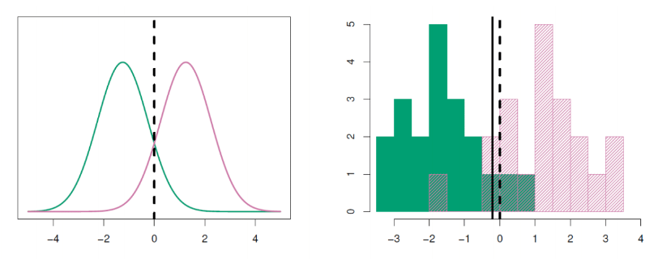
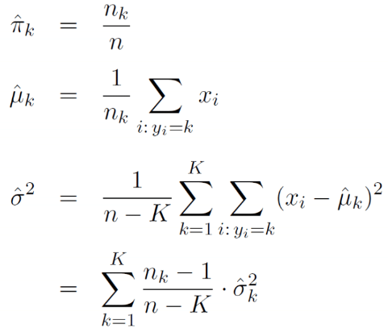
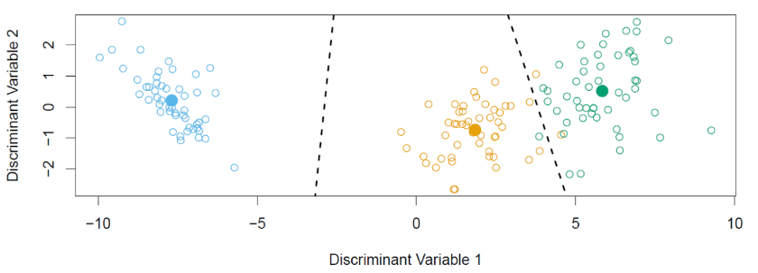

```{r setup, include=FALSE}
knitr::opts_chunk$set(echo = FALSE, message = FALSE, warning = FALSE,
                      fig.width = 6, fig.height = 3)
```

```{r packages, include=FALSE}
library(tidyverse)
library(ggpubr)
library(scales)
library(broom)
library(flextable)
library(scatterplot3d)
library(rgl)
library(caret)
library(reshape2)
library(GGally)
library(pROC)
```

# Review

- Homework 2 due on 2/4 at 11PM through GitHub Classroom
- Article Evaluation 1 assigned, due on 2/9 through GitHub Classroom
- Last lecture: logistic regression

# Classification

Let response $Y \in \{0,1\}$ 

**Goal**: Predict $Y$ using features $X$

**What to model?**:

Let $p_k(x)=\text{Pr}(Y=k|X=x)$, $k=0,1$

Denoted as the **conditional class probabilities** at $x$

<center>
<figure>
    
</figure>
</center>

# Discriminant analysis

* **Idea**: Instead of looking at $f(y|x)$, look at $f(x|y)$ for each class $y=1,2,\ldots,K$
* Try to see if distribution of features $X$ **differs** among the response classes
* Then use *Bayes theorem* to estimate $f(y|x)=\text{Pr}(Y=y|X=x)$
* How to model distribution of $f(x|y)$ given many features $X$?
* *Linear/Quadratic Discriminant Analysis* (L/QDA) $\rightarrow$ normal distribution modeled
  * Can be used with other distributions as well

# Bayes Theorm

* Suppose $Y$ and $X$ are discrete/categorical random variables
* **Bayes Theorem**:

$$
\text{Pr}(Y=k|X=x)=\frac{\text{Pr}(X=x|Y=k)*\text{Pr}(Y=k)}{\text{Pr}(X=x)}
$$

* Also holds for $Y$ and or $X$ continuous:

$$
\text{Pr}(Y=k|X=x)=\frac{f(x|k)*\text{Pr}(Y=k)}{f(x)}
$$

where 

* $f(x|k)$ denotes the conditional density of $X|Y$
* $f(x)$ denotes the density of $X$

# Bayes Theorm for Classification

* We can reformulate this for discriminant analysis:

$$
\text{Pr}(Y=k|X=x)=\frac{f(x|k)*\text{Pr}(Y=k)}{\sum_{l=1}^{K} f(x|l)*\text{Pr}(Y=l)}
$$

* $f(x|l)$ modeled using a chosen distribution (Normal in our case)
* In Bayes, $\text{Pr}(Y=k)$ denoted as the *prior* probability for class *k*
  * i.e., probability not based on features $X=x$
  
# Posterior Probability

* In Bayes, $\text{Pr}(Y=k|X=x)$ denoted as *posterior probability*
  * i.e. probability of being in class $k$ based on features $X=x$ ("post" seeing data)
* **Idea**: To classify an observation with feature set $x_0$, choose class with max posterior probability
* i.e., $\hat{y_0}=\underset{k=1,\ldots,K}{\operatorname{argmax}}\frac{f(x_0|k)*\text{Pr}(Y=k)}{\sum_{l=1}^{K} f(x_0|l)*\text{Pr}(Y=l)}$
* This rule is the same rule as used in logistic regression, KNN, etc.
  * **Difference**: Computing conditional probability differently
* **Note**: Denominator is the same for each posterior probability
  * $\rightarrow$ $\hat{y_0}=\underset{k=1,\ldots,K}{\operatorname{argmax}}f(x_0|k)*\text{Pr}(Y=k)$
  
# Why discriminant analysis?
* Logistic regression limitations:
  * Classes are well-separated $\rightarrow$ logistic regression model unstable
  * Not well suited for multi-category response prediction (required many models)
* Discriminant analysis (DA) improves on stability and well-suited for multi-category response
* If $n$ is small and $X$ $\sim$ Normal in each class, DA more stable

# LDA when $p=1$
* Univariate Normal density:

$$
f(x|k)=\frac{1}{\sqrt{2\pi}\sigma_k}e^{-0.5(\frac{x-\mu_k}{\sigma_k})^2}
$$

where $\mu_k=\text{E}(X|Y=k)$ and $\sigma_k=\sqrt{\text{Var}(X|Y=k)}=\text{SD}(X|Y=k)$

* **With LDA** assume $\sigma_k=\sigma$ for all $k=1,\ldots,K$
  * i.e. assume variance/SD in feature same in all response classes
  
# LDA when $p=1$
* We can plug the above into our posterior probability formula from before:

$$
\text{Pr}(Y=k|X=x)=\frac{\text{Pr}(Y=k)\frac{1}{\sqrt{2\pi}\sigma_k}e^{-0.5(\frac{x-\mu_k}{\sigma_k})^2}}{\sum_{l=1}^{K} \text{Pr}(Y=l)\frac{1}{\sqrt{2\pi}\sigma_l}e^{-0.5(\frac{x-\mu_l}{\sigma_l})^2}}
$$

# LDA Simplifications
* As done with maximum likelihood, can simplify this max procedure by taking the log
  * $\text{log}[f(x)]$ is **monotonic**, so if $x_0$ maxes $\text{log}[f(x)]$ $\rightarrow$ maxes $f(x)$
* Can also discard terms which don't involve $k$ (as these are the same for all classes)
* Results in transformation of posterior: $\delta_k(x)$

$$
\delta_k(x)=x*\frac{\mu_k}{\sigma^2}-\frac{\mu_k^2}{2\sigma^2}+\text{log}(\pi_k)
$$

where $\delta_k(x)=\max\{\delta_1(x), \ldots,\delta_K(x)\}$ 

$\leftrightarrow$ 

$\text{Pr}(Y=k|X=x)=\underset{l=1,\ldots,K}{\operatorname{max}}\{\text{Pr}(Y=l|X=x)\}$

# LDA Simplifications

* Thus, can work with $\delta_k(x)$, denoted *discriminant score* instead
* Can see $\delta_k(x)$ is *linear* function of $x$ (hence *linear* DA)
* Can show if $K=2$ and priors $\text{Pr}(Y=1)=\text{Pr}(Y=2)=0.5$, *decision boundary* is at

$$
x=\frac{\mu_1+\mu_2}{2}
$$

# LDA Visualization
<center>
<figure>
    
    <figcaption>Left (true distribution); Right (estimated from data)</figcaption>
</figure>
</center>

* **Idea**: Feature distributions between classes differ, find differences in data using classes labels
* Need to estimate parameters (example $\mu_1=-1.5, \mu_2=1.5, \pi_1=\pi_2=0.5, \sigma^2=1$)

# LDA Estimation
<center>
<figure>
    
</figure>
</center>

* where $\hat{\sigma_k^2}=\frac{1}{n_k-1}\sum_{i:y_i=k}(x_i-\mu_k)^2$ is the usual estimator for variance in class $k$
  * Pool estimate over all classes due to $\sigma_1^2=\ldots=\sigma_K^2=\sigma^2$
  
# LDA with $p>1$
<center>
<figure>
    
</figure>
</center>

# LDA: Estimating Probabilities
* Given $\hat{\delta_k}(x)$, can compute estimated class probabilities:

$$
\hat{\text{Pr}}(Y=k|X=x)=\frac{e^{\hat{\delta}_k(x)}}{\sum_{l=1}^{K}e^{\hat{\delta}_l(x)}}
$$

* Just undoing log in probability equation from before by using $e$
* To classify, can use usual rule of largest $\hat{\delta_k}(x)$ $\leftrightarrow$ largest $\hat{\text{Pr}}(Y=k|X=x)$

# Example with $p>1$
<center>
<figure>
    
</figure>
</center>

# LDA Example
* Heart disease prediction
* **NOTE**: Do our features follow normal distributions within heart disease status?

```{r fig.width = 12, fig.height = 4}
heart_data <- read_csv(file="../data/heart_disease/Correct_Dataset.csv") %>%
  mutate(heart_disease = 
           relevel(factor(ifelse(Target>0, "Yes", "No")), 
                   ref = "No"))
```

```{r, echo=TRUE}
# Partition Data
set.seed(12)
train_test_indices <- createDataPartition(heart_data$heart_disease, p=0.6, list = FALSE)
heart_data_train <- heart_data[train_test_indices,]
heart_data_test <- heart_data[-train_test_indices,]

# Train
lda_fit <- train(heart_disease~Age+Sex+Chest_Pain+Resting_Blood_Pressure+Colestrol+
                MAX_Heart_Rate+Exercised_Induced_Angina, 
                data = heart_data_train, method = "lda")

# Add in test set predictions
heart_data_test$estimated_prob_heart_disease <-
  predict(lda_fit, newdata=heart_data_test, type = "prob")$Yes

heart_data_test <-
  heart_data_test %>%
  mutate(pred_heart_disease = 
           relevel(factor(ifelse(estimated_prob_heart_disease>0.5, "Yes", "No")),
                   ref = "No"))

# Compute confusion matrix
confusionMatrix(data = heart_data_test$pred_heart_disease,
                reference = heart_data_test$heart_disease,
                positive = "Yes")
```

# LDA Example: Varying Threshold
* Used a threshold of 0.5, but may see "better" performance using a different one
* Can analyze all thresholds using ROC curve

```{r, echo=TRUE}
# Using pROC, add ROC curve using estimated probabilities of heart disease in test set
roc_obj <- 
  roc(response = heart_data_test$heart_disease, 
    predictor = heart_data_test$estimated_prob_heart_disease)

# Print obj
roc_obj

# Plot curve
plot(roc_obj, main = paste0("ROC curve for heart disease prediction on test set\n AUC=",
                            round(auc(roc_obj),2)))
```

# LDA Example: Training Set Performance
* Looking back at training set performance, expect this to be biased upward 

```{r, echo=TRUE}
# Add in train set predictions
heart_data_train$estimated_prob_heart_disease <-
  predict(lda_fit, newdata=heart_data_train, type = "prob")$Yes

heart_data_train <-
  heart_data_train %>%
  mutate(pred_heart_disease = 
           relevel(factor(ifelse(estimated_prob_heart_disease>0.5, "Yes", "No")),
                   ref = "No"))

# Compute confusion matrix
confusionMatrix(data = heart_data_train$pred_heart_disease,
                reference = heart_data_train$heart_disease,
                positive = "Yes")
```

# LDA Example: Training Set Performance
* Training set ROC curve:

```{r, echo=TRUE}
# Using pROC, add ROC curve using estimated probabilities of heart disease in test set
roc_obj <- 
  roc(response = heart_data_train$heart_disease, 
    predictor = heart_data_train$estimated_prob_heart_disease)

# Print obj
roc_obj

# Plot curve
plot(roc_obj, main = paste0("ROC curve for heart disease prediction on training set\n AUC=",
                            round(auc(roc_obj),2)))
```

# Other forms of discriminant analysis
* **Recall** starting formula for posterior class probabilities:

$$
\text{Pr}(Y=k|X=x)=\frac{f(x|k)*\text{Pr}(Y=k)}{\sum_{l=1}^{K} f(x|l)*\text{Pr}(Y=l)}
$$

* For LDA, used Normal densities for $f(x|k)$, but could use different distribution to obtain different model
* For LDA, under Normal density model, also assumed $\Sigma_k=\Sigma$ for all $k$ (classes)
  * That is, assumed all classes have same covariance matrix for features
  * May not be reasonable
  * Normal densities but different $\Sigma_k$ om each class $\rightarrow$ **quadratic discriminant analysis**
  * If we additional assume features on independent in each class, i.e. $f(x|k)=\prod_{j=1}^pf(x_j|k)$, obtain **naive Bayes**
  
# QDA Example
* Again, heart disease example
* **NOTE**: Do our features meet the normal distribution assumption?
```{r, echo=TRUE}
# Train
qda_fit <- train(heart_disease~Age+Sex+Chest_Pain+Resting_Blood_Pressure+Colestrol+
                MAX_Heart_Rate+Exercised_Induced_Angina, 
                data = heart_data_train, method = "qda")

# Add in test set predictions
heart_data_test$estimated_prob_heart_disease <-
  predict(qda_fit, newdata=heart_data_test, type = "prob")$Yes

heart_data_test <-
  heart_data_test %>%
  mutate(pred_heart_disease = 
           relevel(factor(ifelse(estimated_prob_heart_disease>0.5, "Yes", "No")),
                   ref = "No"))

# Compute confusion matrix
confusionMatrix(data = heart_data_test$pred_heart_disease,
                reference = heart_data_test$heart_disease,
                positive = "Yes")
```

# QDA Example: Varying Threshold
* Test set ROC curve

```{r, echo=TRUE}
# Using pROC, add ROC curve using estimated probabilities of heart disease in test set
roc_obj <- 
  roc(response = heart_data_test$heart_disease, 
    predictor = heart_data_test$estimated_prob_heart_disease)

# Print obj
roc_obj

# Plot curve
plot(roc_obj, main = paste0("ROC curve for heart disease prediction on test set\n AUC=",
                            round(auc(roc_obj),2)))
```

# Discriminant analysis summary
* **General rule**:

$$
\hat{y_0}=\underset{k=1,\ldots,K}{\operatorname{argmax}}\frac{f(x_0|k)*\text{Pr}(Y=k)}{\sum_{l=1}^{K} f(x_0|l)*\text{Pr}(Y=l)}=\underset{k=1,\ldots,K}{\operatorname{argmax}}f(x_0|k)*\text{Pr}(Y=k)
$$

* LDA: assume all $f(x|k)\sim \text{Multivariate Normal}(\mu_k, \Sigma)$ for $k=1,\ldots,K$
* QDA: assume $f(x|k)\sim \text{Multivariate Normal}(\mu_k, \Sigma_k)$ for $k=1,\ldots,K$
  * Can fit QDA in `caret` package with `train` function using `method="qda"`
  
# Song of the session
[Bad Boy by BIGBANG](https://www.youtube.com/watch?v=1qnV55LUFVM)

[Blue by BIGBANG](https://www.youtube.com/watch?v=2GRP1rkE4O0)

<center>
<figure>
    
</figure>
</center>