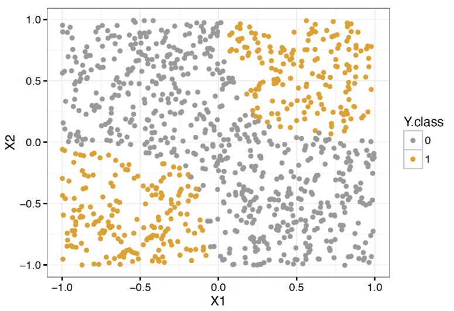

```{r setup, include=FALSE}
knitr::opts_chunk$set(echo = FALSE, message = FALSE, warning = FALSE,
                      fig.width = 6, fig.height = 3)
```

```{r packages, include=FALSE}
library(tidyverse)
library(ggpubr)
library(scales)
library(broom)
library(flextable)
library(scatterplot3d)
library(rgl)
library(caret)
library(reshape2)
library(GGally)
library(pROC)
library(klaR)
```

# Review

- Homework 3 due on 2/12 at 11PM through GitHub Classroom
- Article Evaluation 1 assigned, due on 2/9 through GitHub Classroom
- Last lecture: linear and quadratic discriminant analysis

# Discriminant Analysis
**Posterior Class Probability**:

$$
\text{Pr}(Y=k|X=x)=\frac{f(x|k)*\text{Pr}(Y=k)}{\sum_{l=1}^{K} f(x|l)*\text{Pr}(Y=l)}
$$

**Prediction Rule**: Given features $x_0$

$$
\hat{y_0}=\underset{k=1,\ldots,K}{\operatorname{argmax}}\frac{f(x_0|k)*\text{Pr}(Y=k)}{\sum_{l=1}^{K} f(x_0|l)*\text{Pr}(Y=l)}=\underset{k=1,\ldots,K}{\operatorname{argmax}}f(x_0|k)*\text{Pr}(Y=k)
$$

# LDA and QDA
$$
\text{Pr}(Y=k|X=x)=\frac{f(x|k)*\text{Pr}(Y=k)}{\sum_{l=1}^{K} f(x|l)*\text{Pr}(Y=l)}
$$

- Linear discriminant analysis (LDA)
  - Within classes, features are mutivariate normally distributed with **same** covariance structures $\leftrightarrow$
  - $f(x|k)\sim \text{Multivariate Normal}(\mu_k, \Sigma)$ for $k=1,\ldots,K$
- Quadratic discriminant analysis (QDA)
  - Within classes, features are mutivariate normally distributed with **possibly different** covariance structures $\leftrightarrow$
  - $f(x|k)\sim \text{Multivariate Normal}(\mu_k, \Sigma_k)$ for $k=1,\ldots,K$
  
# LDA vs logistic regression
For two-class prediction problem, can show for LDA, discriminant function $\rightarrow$

$$
\text{log}\Bigg(\frac{\text{Pr}(Y=1|X=x)}{\text{Pr}(Y=0|X=x)}\Bigg)=c_0+c_1x_1+\ldots+c_px_p
$$

and from logistic regression:

$$
\text{logit}(p) =\text{log}\Bigg(\frac{\text{Pr}(Y=1|X=x)}{\text{Pr}(Y=0|X=x)}\Bigg)=\beta_0+\beta_1x_1+\ldots+\beta_px_p
$$

so the two have the same form.

# LDA vs logistic regression
Difference = **how parameters are estimated**

- Logistic regression uses conditional likelihood based on $\text{Pr}(Y=1|X)$, denoted *discriminative learning*
- LDA uses **full likelihood** based on $f(x, y)$ with Bayes Rule, denoted *generative learning*
- However, in practice results often very similar

# LDA vs logistic regression differences
- When classes are **well separated**, i.e. $\text{Pr}(Y=1|X)$ near 0 or 1, logsitic regression coefficients are **very unstable**.  Not the case with LDA
- LDA makes assumptions on the distribution of $X|Y=k$ (Normality, same covariance)
  - When assumptions hold, LDA can produce *more stable* decision boundaries, even with small $n$
- When $K=2$, due to a lack of assumptions on the distribution of $X|Y=k$, logisitic regression can be extended in many kinds of ways and is highly interpretable
  - Hard to interpret/implement well for $K>2$ classes.  LDA is largely the same implementation-wise regardless of $K$
  
# Naive Bayes

**Recall**: Posterior class probability general form

$$
\text{Pr}(Y=k|X=x)=\frac{f(x|k)*\text{Pr}(Y=k)}{\sum_{l=1}^{K} f(x|l)*\text{Pr}(Y=l)}
$$

**Discriminant analysis**: alter form of $f(x|k)$ to get new method

- With normal distribution but different $\Sigma_k$ in each class $\rightarrow$ QDA
- Keeping normal distribution assumption, let's assume **features are independent** in each class
  - This is **not** assuming features are *marginally independent*, i.e. independent in the entire population
  - Denoted *conditional independence*
  - For multivariate normal, this means $\Sigma_k$, **within-class feature correlations** are 0
  - In the likelihood, formulation is simplified as $\Sigma_k$ are diagonal 
  - Method denoted as *Naive Bayes*
  
# Naive Bayes
- Simple structure very useful when number of predictors $p$ is large
- Ex. imagine $p=1000$ and $n=2000$.  With LDA and QDA, estimating within-class correlations of features very difficult, even if equal correlations across classes is assumed (LDA)
  - Instead, Naive Bayes *assumes* components of $X=(X_1, \ldots, X_p)$ are independent
- Under independence, within-class feature distriubtion simplifies to:

$$
\begin{align}
f(x|k)&=f(x_1, x_2, \ldots, x_p|k) \\
&=f(x_1|k)*\ldots*f(x_p|k) \\
&=\prod_{j=1}^{p}f(x_j|k)
\end{align}
$$

- Multivariate densities go away, only need to estimate $p$ *univariate* densities $f(x_j|k)$

# Naive Bayes
- Assume each feature is normally distributed in each class
  - Discriminant function: 
  
$$
\begin{align}
\delta_k(x) &\propto \text{log}\Big[\Pr(Y=k)f(x|k)\Big] \\
&=\Pr(Y=k)\prod_{j=1}^p f(x_j|k) \text{ by independent features within class} \\
&=-\frac{1}{2}\sum_{j=1}^p \Big[\frac{(x_j-\mu_{kj})^2}{\sigma_{kj}^2} + \text{log}(\sigma_{kj}^2) \Big] + \text{log}[\Pr(Y=k)] \text{ by independent normality within class}
\end{align}
$$

- **Notice**: Use of independence provides more flexibility on choice of distribution for each feature within the class
  - $\rightarrow$ Naive Bayes can be used for *mixed* feature vectors (qualitative **and** quantitative).  If quantitative, model $f(x_j|k)$ using *probability mass function*
  - Can also set other continuous densities for specific features (ex. variable is skewed within classes)
- Distributional flexibility comes at cost of independence assumption

# Naive Bayes
- Ex. Heart disease prediction
- **Recall**: Had non-normal/categorical features

```{r fig.width = 15, fig.height = 13}
heart_data <- read_csv(file="../data/heart_disease/Correct_Dataset.csv") %>%
  mutate(heart_disease = 
           relevel(factor(ifelse(Target>0, "Yes", "No")), 
                   ref = "No"))

ggpairs(heart_data, columns = 
          c("Age","Sex","Chest_Pain","Resting_Blood_Pressure","Colestrol",
                "MAX_Heart_Rate","Exercised_Induced_Angina"),
        ggplot2::aes(colour=heart_disease))
```

# Naive Bayes
- Ex. Heart disease prediction
- **Recall**: Had non-normal/categorical features
- **Note**: Need R package `klaR` to do in `caret`

```{r fig.width = 15, fig.height = 13, echo=TRUE}
# Need to set categorical values to "factor" to get correct modeling of densities
heart_data <-
  heart_data %>%
  mutate(Sex=factor(Sex),
         Chest_Pain=factor(Chest_Pain),
         Exercised_Induced_Angina=factor(Exercised_Induced_Angina))

# Partition Data
set.seed(12)
train_test_indices <- createDataPartition(heart_data$heart_disease, p=0.6, list = FALSE)
heart_data_train <- heart_data[train_test_indices,]
heart_data_test <- heart_data[-train_test_indices,]

# Train
nb_fit <- train(heart_disease~Age+Sex+Chest_Pain+Resting_Blood_Pressure+Colestrol+
                MAX_Heart_Rate+Exercised_Induced_Angina, 
                data = heart_data_train, method = "nb")

# Add in test set predictions
heart_data_test$estimated_prob_heart_disease <-
  predict(nb_fit, newdata=heart_data_test, type = "prob")$Yes

heart_data_test <-
  heart_data_test %>%
  mutate(pred_heart_disease = 
           relevel(factor(ifelse(estimated_prob_heart_disease>0.5, "Yes", "No")),
                   ref = "No"))

# Compute confusion matrix
confusionMatrix(data = heart_data_test$pred_heart_disease,
                reference = heart_data_test$heart_disease,
                positive = "Yes")

```

# Naive Bayes
- Ex. Heart disease prediction
- Can use `NaiveBayes` function in `klaR` package to see estimated conditional densities/distributions for each feature

```{r echo=TRUE}
# Observe MLEs of parameters
nb_ests <- NaiveBayes(heart_disease~Age+Sex+Chest_Pain+Resting_Blood_Pressure+Colestrol+
                MAX_Heart_Rate+Exercised_Induced_Angina,
           data=heart_data_train,
           na.action = na.omit)

nb_ests$tables
```

# Naive Bayes
**Overview**:

- Training Phase:
  - For class $k$, estimate $\pi_k=\Pr(Y=k)$ using $\hat{\pi_k}=\frac{1}{n}\sum_{i=1}^{n}I(Y_i=k)$
  - For feature $X_j$
    - If $X_j$ is continuous, estimate $\text{E}(X_j|Y=k)=\mu_{x_j|k}$ and $\text{Var}(X_j|Y=k)=\sigma_{x_j|k}^2$ using within-class sample mean and variance
    - If $X_j$ is categorical, estimate $\text{Pr}(X_j=x_{jl}|Y=k)=\theta_{jlk}$ where $l$ is a category $X_j$ can take
    - Do so for each class $k$ in sample
- Testing Phase:
  - For subject with features $x_0=(x_{01}, \ldots, x_{0p})$, predict outcome $y_0$ using

$$
\hat{y_0}=\underset{k=1,\ldots,K}{\operatorname{argmax}}\hat{\pi_k}\prod_{j=1}^{p}\hat{f}(x_{0j}|k)
$$

  - Where $\hat{f}(x_{0j}|k)$ is obtained by plugging in 
    - conditional probabilities obtained in training if $X_j$ is categorical 
    - conditional means and variances obtained in training if $X_j$ is continuous 
    
# Naive Bayes
- Ex. Heart disease prediction
```{r echo=TRUE, fig.width = 14, fig.height = 9}
# Plot "prior probabilities
prior_probs <- data.frame("heart_disease"=unname(names(nb_ests$apriori)),
                             "prior_prob"=as.numeric(nb_ests$apriori))
prior_probs_plot <-
  ggplot(data=prior_probs, mapping=aes(x=heart_disease, y=prior_prob,
                                       fill=heart_disease))+
  geom_bar(stat="identity")+
  labs(x="Heart disease", y="Prior probability")+
  theme_classic()+
  theme(legend.position = "none",
        text=element_text(size=20))

# Plot density for max heart rate
max_heart_rate_density <-
  ggplot(data=heart_data_train, mapping=aes(x=MAX_Heart_Rate, 
                                            fill=heart_disease))+
  geom_density(alpha=0.5)+
  labs(fill="Heart disease", x="Max. heart rate")+
  theme_classic()+
  theme(text=element_text(size=20))

# Plot distribution for Chest_Pain
chest_pain_density <-
  ggplot(data=heart_data_train, mapping=aes(x=Chest_Pain, 
                                            group=heart_disease))+
  geom_bar(aes(y = ..prop.., fill = factor(..x..)), stat="count")+
  geom_text(aes( label = scales::percent(..prop..),
                   y= ..prop.. ), stat= "count", vjust = -0.25,
            size=4) +
  facet_grid(~heart_disease)+
  labs(fill="", x="Chest pain")+
  theme_classic()+
  theme(legend.position = "none",
        text=element_text(size=20))

post_probs <- 
  ggplot(data=heart_data_test,
         mapping=aes(x=heart_disease, y=estimated_prob_heart_disease,
                     fill=heart_disease))+
  geom_boxplot()+
  labs(x="Heart disease", y="Posterior probability")+
  theme_classic()+
  theme(legend.position = "none",
        text=element_text(size=20))

# Create 4-panel plot
ggarrange(plotlist = list(prior_probs_plot, max_heart_rate_density,
                          chest_pain_density, post_probs),
          ncol=2, nrow=2)

```

# Naive Bayes vs LDA vs QDA
- Naive Bayes scales well to problems where $p$ is large
  - Need large enough $n$ to estimate univariate properties of each feature
  - With LDA have $K*p$ parameters for $\text{E}(X_j|Y=k)$ and $0.5*p*(p+1)$ parameters for feature covariance matrix $\Sigma$
  - With QDA have $0.5*K*p*(p+1)$ parameters for the $K$ covariance matrices $\Sigma_k$
- However, LDA and QDA can capture and use **interactions in features** for prediction, Naive Bayes cannot

# Feature interaction example
<center>
<figure>
    
</figure>
</center>

# Songs of the session
[Mexican Grand Prix by Mogwai](https://www.youtube.com/watch?v=BJZQ9xBrkWo)

[Your Hand in Mine by Explosion in the Sky](https://www.youtube.com/watch?v=cdiY6kijYHE)

[Pacific Theme by Broken Social Club](https://www.youtube.com/watch?v=cdiY6kijYHE)

[The Big Ship by Brian Eno](https://www.youtube.com/watch?v=lCCJc_V8_MQ)

<center>
<figure>
    
</figure>
<figure>
    
</figure>
</center>
