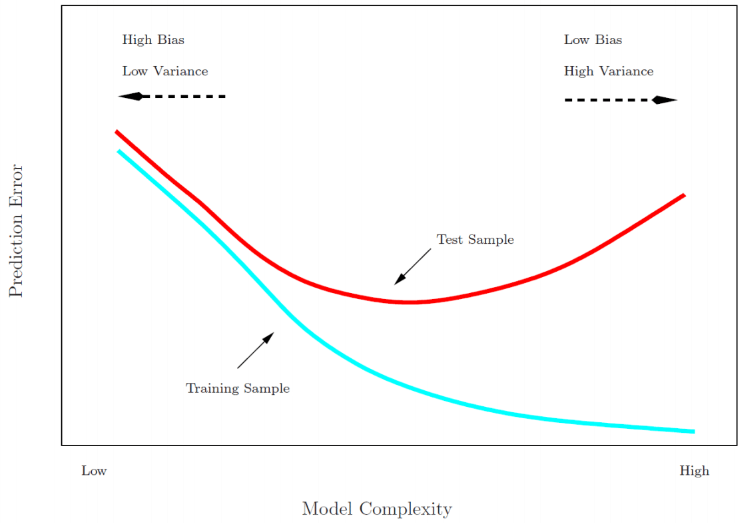
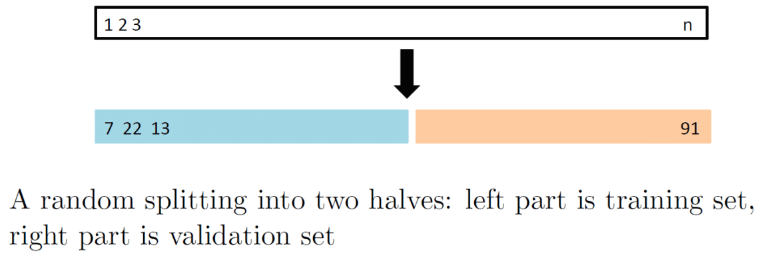
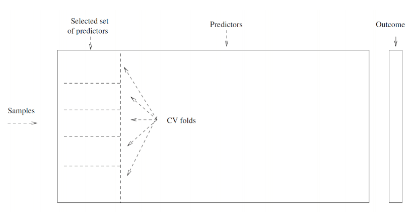
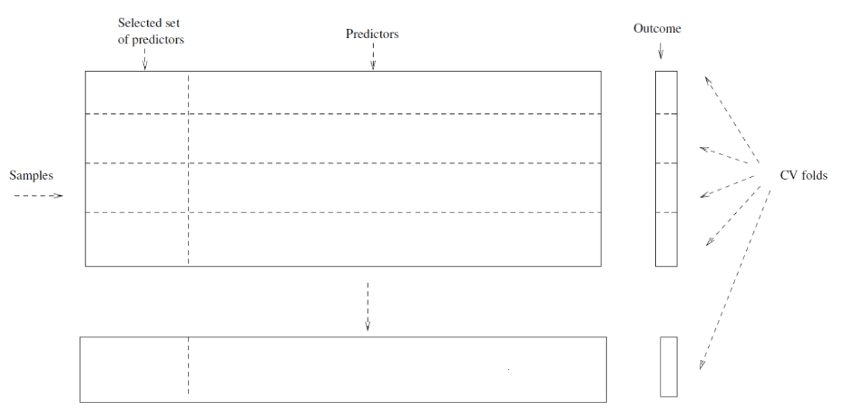

```{r setup, include=FALSE}
knitr::opts_chunk$set(echo = FALSE, message = FALSE, warning = FALSE,
                      fig.width = 6, fig.height = 3)
```

```{r packages, include=FALSE}
library(tidyverse)
library(mgcv)
library(splines)
library(ISLR)
library(caret)
library(rmarkdown)
```

# Review

- Homework 4 due on 2/26 at 11PM through GitHub Classroom
- Article Evaluation 1 assigned, due on 3/2 through GitHub Classroom
- Last lecture: nonlinear modeling using splines

# Prediction Error

- Recall prediction error can be calculated a variety of subsets of your data

1. **training error**: average error when predicting outcome on data used to create algorithm
2. **testing error**: average error when predicting outcome on data from that used in training

- Training error poor measure of algorithm's performance on general sample from population
  - **Biased downward**
  - Need separate and **independent** datasets for testing and training
  
<center>
<figure>
    
</figure>
</center>
  
# Training and Testing
1. Training and Tuning

<center>
<figure>
    
</figure>
</center>

2. Training, Tuning, and Testing

<center>
<figure>
    
</figure>
</center>

# Testing error

- Various ways have been developed to estimate this testing error:

1. "Correct" training set error to be more generalizable
  - **Idea**: $Error=f(MSE)+\lambda*ModelComplexity$ where $\lambda>0$
  - Ex. *Mallow's Cp, AIC, BIC*
  
2. Use large, independent and separate test set
  - Often not available, though best option
  
3. Generate test set using **hold out**
  - Randomly split available data into 2 partitions
  - Use one partition for training, other for testing
  - Testing = predict outcome on test set, compute prediction error (ex. MSE or misclassification rate)
  
# Hold out

<center>
<figure>
    
</figure>
</center>

```{r, echo=TRUE}
wage_data <- Wage # contained in ISLR package
# Holdout 40% for tesing
tt_indicies <- createDataPartition(y=wage_data$wage, p=0.6, list = FALSE)
wage_data_train <- wage_data[tt_indicies,]
wage_data_test <- wage_data[-tt_indicies,]

# Look at datasets
paged_table(wage_data_train)
paged_table(wage_data_test)
```

# Training and testing

- Consider fitting nonlinear polynomial to wage data
- Using training error vs. testing error to choose spline order

```{r fig.width = 6, fig.height = 6}
## Set degrees being considered:
degrees <- 1:10
poly_reg_fit <- list()
error_rates_degrees <- list()

# Fit model for each degree considered, compute RMSE (on training in this ex.)
for(i in 1:length(degrees)){
  poly_reg_fit[[i]] <- lm(wage~poly(age, degrees[i]),
                   data=wage_data)
  
  predict_wages <- predict(poly_reg_fit[[i]])
  residuals_wages <- wage_data$wage-predict_wages
  rmse_poly_reg <- sqrt(mean(residuals_wages^2))
  mae_poly_reg <- mean(abs(residuals_wages))
  
  # Save in data frame
  error_rates_degrees[[i]] <-
    data.frame("RMSE"=rmse_poly_reg,
               "MAE"=mae_poly_reg,
               "degree"=degrees[i])
}

# Bind all degree-specific results together into single data frame/table
error_rates_degrees_df <- do.call("rbind", error_rates_degrees)

# Plot results as function of degree
ggplot(data=error_rates_degrees_df,
       mapping=aes(x=degrees, y=RMSE))+
  geom_point()+
  geom_line()+
  labs(title="RMSE (Root Mean Squared Error) by degree without data splitting")

# Line continuously decreases, though seems improvement after 3 or 4 is minimal
# For better assessment, split into training (60:40 split for ex)

# Fit model for each degree considered, compute RMSE (on training in this ex.)
poly_reg_fit <- list()
error_rates_degrees <- list()

counter <- 1
trials <- 10 # Look at 10 different 60:40 splits

wage_data_subset <- wage_data[sample(1:dim(wage_data)[1], size=400, replace=FALSE),]
for(j in 1:trials){
  set.seed(j) # Set seed to get different splits
  
  tt_indicies <- createDataPartition(y=wage_data_subset$wage, p=0.6, list = FALSE)
  wage_data_train <- wage_data_subset[tt_indicies,]
  wage_data_test <- wage_data_subset[-tt_indicies,]
  
  for(i in 1:length(degrees)){
    poly_reg_fit[[counter]] <- lm(wage~poly(age, degrees[i]),
                     data=wage_data_train)
    
    predict_wages <- predict(poly_reg_fit[[counter]], newdata = wage_data_test)
    residuals_wages <- wage_data_test$wage-predict_wages
    rmse_poly_reg <- sqrt(mean(residuals_wages^2))
    mae_poly_reg <- mean(abs(residuals_wages))
    
    # Save in data frame
    error_rates_degrees[[counter]] <-
      data.frame("RMSE"=rmse_poly_reg,
                 "MAE"=mae_poly_reg,
                 "degree"=degrees[i],
                 "split_trial"=j)
    counter <- counter+1
  }
}
  
  # Bind all degree-specific results together into single data frame/table
  error_rates_degrees_df <- do.call("rbind", error_rates_degrees)
  
  # Plot results as function of degree
  ggplot(data=error_rates_degrees_df,
         mapping=aes(x=degree, y=log(RMSE), color=factor(split_trial)))+
    geom_point()+
    geom_line()+
    labs(title="RMSE (Root Mean Squared Error) by degree on test set\nBy split number")+
    theme_bw()
```

# Drawbacks of holdout
- Test set error can be highly dependent on split
  - Thus **highly variable**
  - Especially for small dataset or **small group sizes**
- Only subset of data used to train algorithm
  - May result in poorer algorithm
  - $\rightarrow$ may **overestimate** test error
- Can we **aggregate results over multiple test sets?**

# K-fold cross validation
- **Widely used** approach for estimating test error
- **Idea**: Still use entire data for training but evaluate **average** performance by aggregating over multiple test sets
  - Test sets still must be **independent**
  - Example: 5-fold CV
  
<center>
<figure>
    
</figure>
</center>

# K-fold cross validation
- Denote $K$ folds by $C_1, C_2, \ldots, C_K$, each with $n_k$ observations
- For a given fold $l$:
  1. Train algorithm on data in other folds: $\{C_k\}$ s.t. $k\neq l$
  2. Test by computing predicted values for data in $C_l$ **only**
  3. Repeat for each fold $l=1, \ldots, K$, average error (ex. $MSE_l$)

- K fold CV error rate

$$
CV_{(K)}=\sum_{k=1}^{K}\frac{n_k}{n}MSE_k
$$
where $MSE_k=\sum_{i\in C_k}(y_i-\hat{y_i})^2/n_k$ where $y_i$ is outcome and $\hat{y_i}$ is predicted outcome from training on $C_k$ **only**

- $K=n$ yields $n-fold$ or *leave-one out cross-validation*
- $CV_(K)$ is accurate measure of generalized error rate for algorithm trained on whole sample

# K-fold CV in R

```{r, echo=TRUE}
# 5 fold CV partitions
cv_folds <- createFolds(y=wage_data_subset$wage, k=5)
# Can see whose in fold 1
cv_folds$Fold1

# Look at dataset for fold 1
wage_data_fold_1 <- wage_data_subset[cv_folds$Fold1,]
paged_table(wage_data_fold_1)
```

# K-fold CV analysis
- Let's look back at the nonlinear fitting example from before.  Instead of using a holdout testing method, we use 5-fold CV
```{r, echo=TRUE, fig.width = 6, fig.height = 6}
# Fit model for each degree considered, compute RMSE (on training in this ex.)
poly_reg_fit <- list()
predict_wages <- list()
residuals_wages <- list()
rmse_poly_reg <- list()
mae_poly_reg <- list()
error_rates_degrees <- list()

counter <- 1
trials <- 10 # Look at 10 different 60:40 splits

for(j in 1:trials){
  set.seed(j) # Set seed to get different splits
  
  tt_indicies <- createFolds(y=wage_data_subset$wage, k=5)
  
    for(i in 1:length(degrees)){
      for(f in 1:length(tt_indicies)){
        wage_data_train <- wage_data_subset[-tt_indicies[[f]],]
        wage_data_test <- wage_data_subset[tt_indicies[[f]],]
  
        poly_reg_fit[[f]] <- lm(wage~poly(age, degrees[i]),
                         data=wage_data_train)
        
        predict_wages[[f]] <- predict(poly_reg_fit[[f]], newdata = wage_data_test)
        residuals_wages[[f]] <- wage_data_test$wage-predict_wages[[f]]
        rmse_poly_reg[[f]] <- sqrt(mean(residuals_wages[[f]]^2))
        mae_poly_reg[[f]] <- mean(abs(residuals_wages[[f]]))
      }
        
        # Save in data frame
        error_rates_degrees[[counter]] <-
          data.frame("RMSE"=mean(unlist(rmse_poly_reg)),
                     "MAE"=mean(unlist(mae_poly_reg)),
                     "degree"=degrees[i],
                     "split_trial"=j)
        counter <- counter+1
    }
}
  
  # Bind all degree-specific results together into single data frame/table
  error_rates_degrees_df <- do.call("rbind", error_rates_degrees)
  
  # Plot results as function of degree
  ggplot(data=error_rates_degrees_df,
         mapping=aes(x=degree, y=log(RMSE), color=factor(split_trial)))+
    geom_point()+
    geom_line()+
    labs(title="RMSE (Root Mean Squared Error) by degree using 5-fold CV\nBy split number")+
    theme_bw()
```

# Choosing K: bias-variance tradeoff

- **Recall**: Holdout method uses only portion of data for training
  - $\rightarrow$ test/validation performance **overestimate**
  - $\rightarrow$ more folds $\rightarrow$ more data in training folds $\rightarrow$ better algorithm $\rightarrow$ lower mean error
  - $\rightarrow$ LOOCV least biased estimate of test error
- Compared to hold out, each training set in K-fold contains $\frac{(k-1)n}{k}$ obs
  - Generally more then in holdout $\rightarrow$ less biased estimate
  
# Choosing K: bias-variance tradeoff

- **Recall**: Test set performance from holdout method can vary a lot depending on split
  - $\rightarrow$ not a **precise** measure of test set error
- Can decrease variance using aggregate method like K-fold CV
  - With LOOCV, averaging performance of $n$ trained algorithms  
  - Testing folds differ, but training sets have almost identical set of observations
  - $\rightarrow$ test fold performances **highly correlated**
  - Using K-fold CV with $K<n$ decrease training set overlap $\rightarrow$ less correlated
  - $\rightarrow$ variance of K-fold CV < LOOCV
- This creates a **bias-variance** tradeoff when choosing K 
  -K=5 or 10 generally chosen (based on simulation studies)
  
# CV for classification
- Same process as before, divide data into $K$ partitions $C_1, \ldots, C_K$
- Choose error/accuracy rate of interest
  - E.g. sensitivity, specificity, classification error, etc.
- For classification error
  - Compute CV error
  
$$
CV_K=\sum_{k=1}^{K}\frac{n_k}{n}\text{Error}_k=\frac{1}{K}\sum_{k=1}^{K}\text{Error}_k  
$$

where $\text{Error}_k=\sum_{i \in C_k}I(y_i \neq \hat{y_i})/n_k$

- Can we estimate the **variability** of this estimate?
  - Commonly used estimate of standard error:
  
$$
\hat{\text{SE}}(\text{CV}_k)=\sqrt{\sum_{k=1}^{K}(\text{Error}_k-\overline{\text{Error}_k})^2/(K-1)}
$$

  - While useful, not accurate (**Why?**)
  - Also can be used in continuous prediction CV (using MSE for example)
  
# CV for classification

In R: heart disease prediction with LDA (see lecture 6)

```{r, echo=TRUE, fig.width = 6, fig.height = 6}
heart_data <- read_csv(file="../data/heart_disease/Correct_Dataset.csv") %>%
  mutate(heart_disease = 
           relevel(factor(ifelse(Target>0, "Yes", "No")), 
                   ref = "No"))

# Create lists to hold results
lda_fit <- list()
estimted_probs <- list()
accuracy_rates <- list()

# Create 5 folds
tt_indicies <- createFolds(y=heart_data$heart_disease, k=5)

# Run LDA for each fold, store results
for(f in 1:length(tt_indicies)){
  heart_data_train <- heart_data[-tt_indicies[[f]],]
  heart_data_test <- heart_data[tt_indicies[[f]],]
  
  lda_fit[[f]] <- train(heart_disease~Age+Sex+Chest_Pain+Resting_Blood_Pressure+
                               Colestrol+MAX_Heart_Rate+Exercised_Induced_Angina, 
                             data = heart_data_train, method = "lda")
        
  estimted_probs[[f]] <- predict(lda_fit[[f]], newdata=heart_data_test, type = "prob")$Yes
  pred_heart_disease <- 
    relevel(factor(ifelse(estimted_probs[[f]]>0.5, 
                          "Yes", "No")), ref = "No")
  # Get accuracy rates from output
  accuracy_rates[[f]] <- 
    c(confusionMatrix(pred_heart_disease,
                reference = heart_data_test$heart_disease,
                positive = "Yes")$byClass,
      confusionMatrix(pred_heart_disease,
                reference = heart_data_test$heart_disease,
                positive = "Yes")$overall,
      "fold"=f)
}

accuracy_df <- data.frame(do.call("rbind", accuracy_rates))

# Compute mean and SE for each measure to get CV mean/SE
CV_mean <- accuracy_df %>% 
  select(Sensitivity, Specificity, `Pos.Pred.Value`, `Neg.Pred.Value`, Accuracy) %>% 
  apply(MARGIN = 2, FUN=mean)

CV_se <- accuracy_df %>% 
  select(Sensitivity, Specificity, `Pos.Pred.Value`, `Neg.Pred.Value`, Accuracy) %>%
  apply(MARGIN = 2, FUN=sd)

CV_mean
CV_se
```

# CV with tuning
- **Recall**: Often when training a prediction algorithm, need to select **tuning parameters**
  - Ex. \# of neighbors with KNN, number of features with regression, degree in splines, etc.
  - Where is tuning implemented in CV?
- Example: Consider set of 5000 predictors and 50 samples of data
  - 1. Starting with the 5000 predictors and full data, **first** find 100 predictors with largest correlation with outcome
  - 2. Then train and test an algorithm with only these 100 predictors, using logistic regression as an example
- How do we estimate the algorithm's test set performance without bias?
- Can we only apply CV in step 2, after the predictors have been chosen using the full data?

# NO
- Why?
  - This selection of parameters greatly impacts the algorithm's performance and thus is a form of tuning
  - Tuning needs to be done within the training framework, otherwise you are training and testing on the same dataset
  - Thus, need to do step 1 within your CV scheme
  
# Wrong way: visual
- Only doing step 2 inside CV process

<center>
<figure>
    
</figure>
</center>

# Right way: visual
- Doing both steps 1 and 2 within CV process

<center>
<figure>
    
</figure>
</center>

# Song of the session
[Green Eggs and Ham by Princess Nokia](https://www.youtube.com/watch?v=ZZH4p5DZulo)

[Everything is Beautiful by Princess Nokia](https://en.wikipedia.org/wiki/Everything_Is_Beautiful_(Princess_Nokia_album))

<center>
<figure>
    
</figure>
</center>